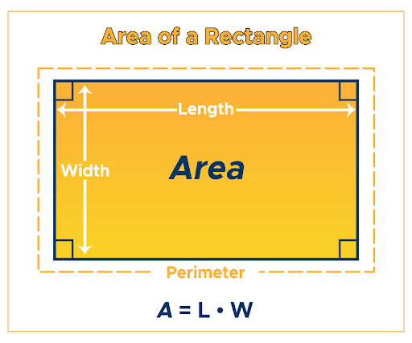

# Площадь и периметр прямоугольника

С клавиатуры вводится **длина** и **ширина** прямоугольника, рассчитать его **площадь** и **периметр**, распечатать их.

Формула расчета
$$area = length*width \newline 
perimeter = 2*(length+width)$$

Пример ввода:

```
14 5
```
Пример вывода:

```
Area - 70 square sm
Perimeter = 38 sm
```

