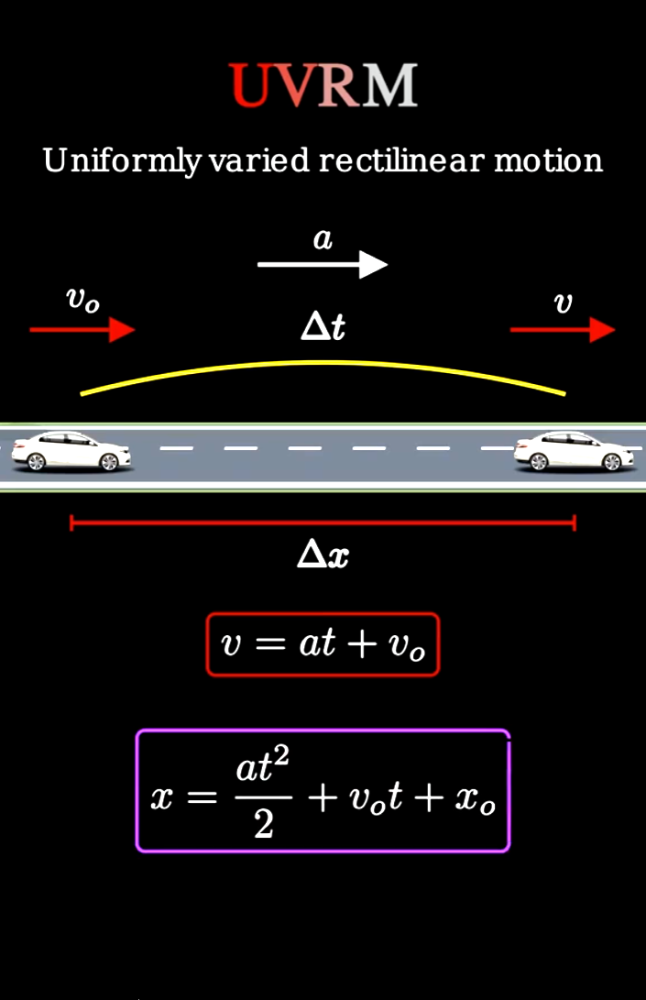

# Равноускоренное движение

Автомобиль начинает движение с начальной скоростью $v_0 \frac{м}{сек}$ (целое число) и движется с постоянным ускорением $a \frac{м}{сек^2}$ (целое число, может быть и отрицательным) в течение $t$ *секунд* (целое неотрицательное число). Пройденный путь (в метрах) вычисляется по формуле:

Формула расчета
$$
S = \frac{at^2}{2} + v_0t
$$

С клавиатуры вводится v_0, a, t

Пример ввода:

```
5 2 3
```
Пример вывода:

```
24 meters
```

