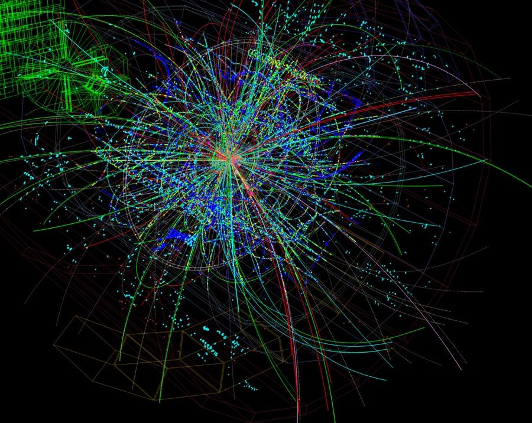

# Релятивистская энергия



Мир не прост, физика изменилась в начале 20 века. Парень по имени Альберт Эйнштейн установил, что только скорость света абсолютна, а все остальное относительное и даже время.

В специальной теории относительности Эйнштейна полная энергия частицы, летящей со скоростью v, равна
$$E = γmc^2\newline
с \approx 3×10^8 - \text{скорость света м/с} \newline
γ = \frac{1}{\sqrt{1 - \frac{v^2}{c^2}}} - \text{Лоренц-фактор}$$

> Чем ближе скорость к световой, тем γ стремится к бесконечности, поэтому разогнать тело с массой до скорости света невозможно – потребовалась бы бесконечная энергия.

В Большом адронном коллайдере протоны разгоняются до  v≈0.999999991c Лоренц-фактор там ≈ 7460
Масса покоя протона $$m=1.67*10^{-27} кг$$

Вычислите энергию разогного протона в БАК. Значение выведите в 
$$1 эВ = 1,602176634⋅10^{−19} Дж$$

### Задача
С стандартного ввода приходит масса в киллограмах и скорость в метрах в секнуду. Рассчитать релятивисткую энергию и распечатать ее в электронвольтах.

Есть несколько тестов. После сборки прогнать все `.txt` в текущей папке:

```
gcc app.c -o a.out -lm
../../../utils/scripts/run_all.sh
```

Пример вывода:

```
=== ./proton999.txt ===
Rel energy - 3.357170e-09 J
Rel energy - 2.095546e+10 eV

=== ./proton9999.txt ===
Rel energy - 1.061391e-08 J
Rel energy - 6.625205e+10 eV

=== ./proton999999.txt ===
Rel energy - 1.061011e-07 J
Rel energy - 6.622833e+11 eV

=== ./proton_light.txt ===
Rel energy - inf J
Rel energy - inf eV

=== ./proton_rest.txt ===
Rel energy - 1.500997e-10 J
Rel energy - 9.369221e+08 eV
```