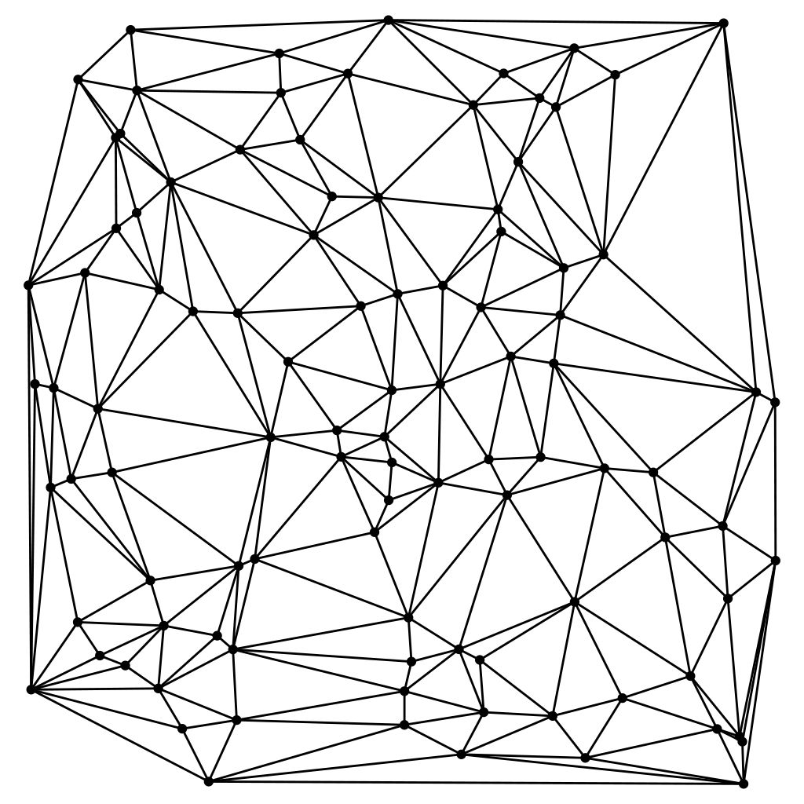

# Площадь треугольника



В компьютерной графике и в играх объекты задают **вершинами** — парами координат \((x, y)\). Площадь треугольника нужна, чтобы понять, «лицом» к камере он повёрнут или нет, попал ли клик внутрь, пересекаются ли полигоны.

> Способ 1 — формула «шнурка»  
> Три точки \(A(x_1, y_1)\), \(B(x_2, y_2)\), \(C(x_3, y_3)\).  
> $$2S = x_1(y_2 - y_3) + x_2(y_3 - y_1) + x_3(y_1 - y_2)$$  
> $$S = \dfrac{|2S|}{2}$$

> Способ 2 — формула Герона  
> Длины сторон — расстояния между точками:  
> $$a = |BC|,\quad b = |AC|,\quad c = |AB|$$  
> $$|AB| = \sqrt{(x_2 - x_1)^2 + (y_2 - y_1)^2}$$  
> (аналогично для \(b\) и \(c\).)  
> Для расстояния используйте `hypot` из `<math.h>` — она устойчивее, чем `sqrt(dx*dx + dy*dy)`.  
> Полупериметр \(p = \dfrac{a + b + c}{2}\).  
> $$S = \sqrt{p\,(p - a)\,(p - b)\,(p - c)}$$

### Задача

Со стандартного ввода — шесть чисел: координаты трёх точек

```
x1 y1 x2 y2 x3 y3
```

Вычислить площадь **двумя способами**. **Без циклов.**

Формат вывода:

```
Shoelace - <значение>
Heron    - <значение>
```

### Примеры

Готовые файлы ввода лежат рядом с заданием: `./a.out < triangle.txt`.

**[triangle.txt](triangle.txt)** — три вершины с **очень большими** координатами, но треугольник — обычный прямоугольный со сторонами 3 и 4.

```
10000000000 10000000000 10000000003 10000000000 10000000000 10000000004
```

```
Shoelace - 6.0000000000000000
Heron    - 6.0000000000000000
```

Подумайте заранее: какой ответ должна дать геометрия? Совпадут ли оба способа?
