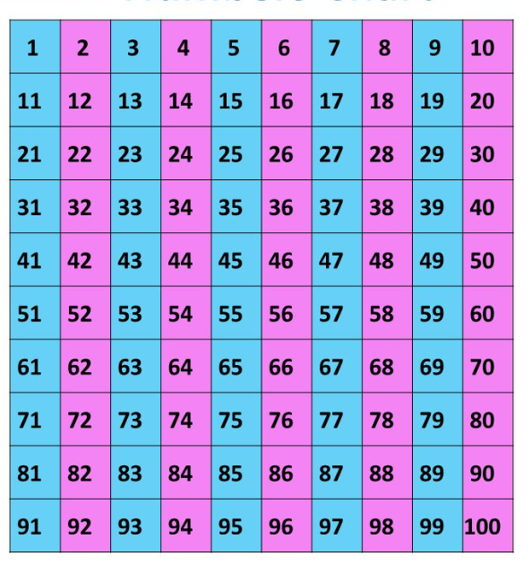

# Чётность числа



С клавиатуры вводится целое число. Вывести `0`, если число **чётное**, и `1`, если **нечётное**.

Пример ввода:

```
4
```

Пример вывода:

```
0
```

Пример ввода:

```
7
```

Пример вывода:

```
1
```
