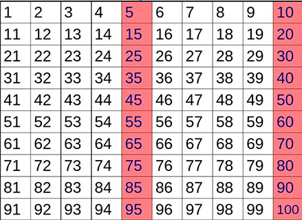

# Делимость на 5



С клавиатуры вводится целое число. Вывести `0`, если число **делится на 5**, и `1`, если **не делится**.

Пример ввода:

```
15
```

Пример вывода:

```
0
```

Пример ввода:

```
7
```

Пример вывода:

```
1
```
