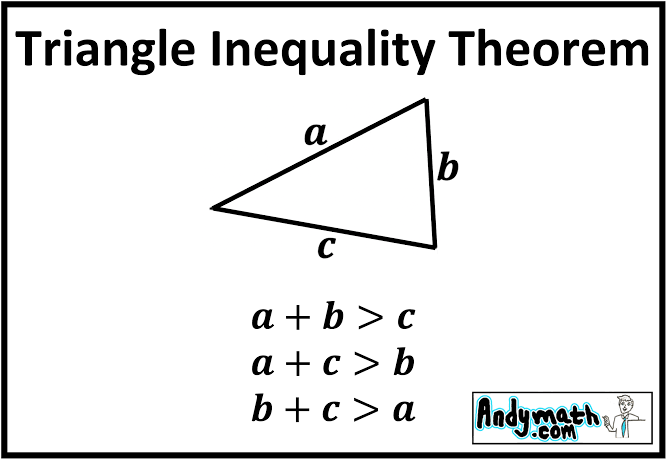

# Стороны треугольника



Даны три числа с плавающей точкой `double a`, `b`, `c` — длины сторон. Напишите выражение, которое проверяет, могут ли эти три числа быть сторонами **невырожденного** треугольника (площадь > 0).

Должны выполняться три неравенства треугольника:

- `a + b > c`
- `a + c > b`
- `b + c > a`

Дополнительно: все стороны должны быть **строго положительными**.

Вывести `1`, если треугольник существует, и `0` в противном случае.

Пример ввода:

```
3 4 5
```

Пример вывода:

```
1
```

Пример ввода:

```
1 2 3
```

Пример вывода:

```
0
```

Пример ввода:

```
0 4 5
```

Пример вывода:

```
0
```
