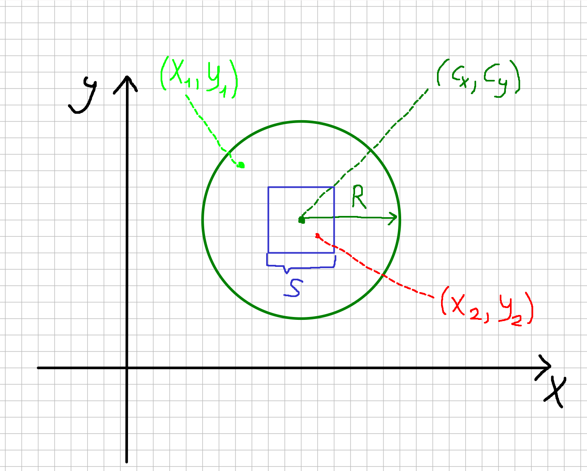

# Точка в круге, но вне квадрата



Даны координаты точки `(x, y)` типа `double`, центр круга `(cx, cy)` того же типа, радиус `R > 0` и длина стороны квадрата `S > 0`. Квадрат ориентирован по осям координат, его центр совпадает с центром круга.

Напишите **выражение**, которое возвращает `1`, если точка лежит **внутри круга** (включая границу) и при этом **не лежит строго внутри квадрата** (граница квадрата не считается «внутри»).

Запрещено использовать условные операторы и циклы.

### Формулы

**Уравнение окружности**

$$(x - cx)^2 + (y - cy)^2 = R^2$$

**Остальное выведите сами!!!**

### Ввод

Шесть чисел:

```
x y cx cy R S
```

### Вывод

`1` или `0`.

### Примеры (`cx = 0`, `cy = 0`, `R = 5`, `S = 6`)

| Ввод | Результат | Пояснение |
|------|-----------|-----------|
| `0 0 0 0 5 6` | `0` | внутри квадрата |
| `2.9 0 0 0 5 6` | `0` | в квадрате, т.к. \|2.9\| < 3 |
| `3.1 0 0 0 5 6` | `1` | в круге, но \|3.1\| ≥ 3 — вне квадрата |
| `4.9 4.9 0 0 5 6` | `0` | вне круга: 4.9² · 2 ≈ 48 > 25 |

Сборка:

```
gcc app.c -o app -lm
```
