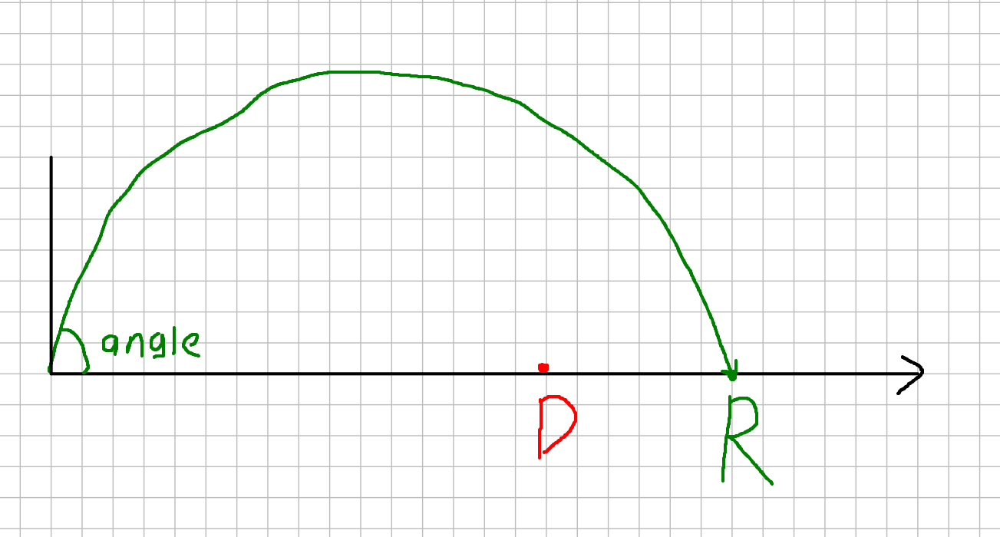

# Попадание по дальности



Тело бросают с начальной скоростью `v` под углом `angle` (в **радианах**) в поле тяготения с ускорением `g`. Цель — на горизонтальном расстоянии `D` от точки броска.

Дальность броска (без сопротивления воздуха):

$$R = \frac{v^2 \sin(2 \cdot \text{angle})}{g}$$

Напишите выражение, которое возвращает `1`, если тело **достигает** цели (дальность ≥ `D`)

**Параметры физически осмыслены**

- `v > 0`, `g > 0`
- `0 < angle < π/2`

### Ввод

Четыре числа:

```
v angle g D
```

### Вывод

`1` или `0`.

### Примеры

`v = 10`, `angle = π/4 ≈ 0.785398`, `g = 10`, `D = 9`:

```
10 0.785398 10 9
```

```
1
```

`D = 11`:

```
10 0.785398 10 11
```

```
0
```

Угол вне диапазона:

```
10 1.6 10 5
```

```
0
```

Сборка:

```
gcc app.c -o app -lm
```
