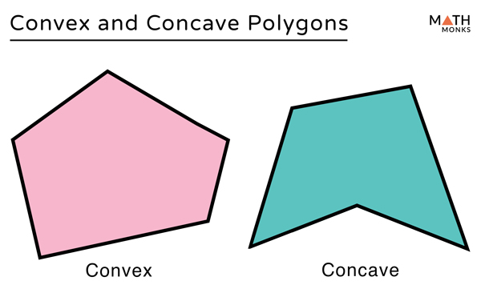
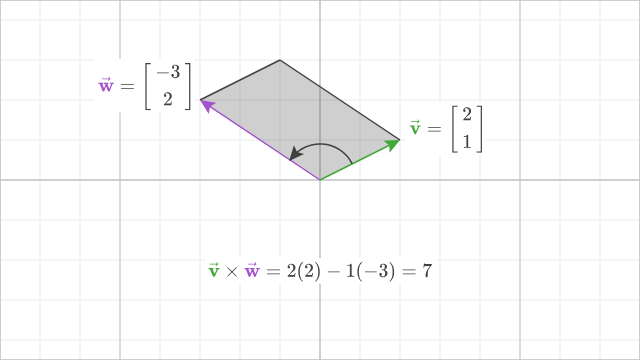
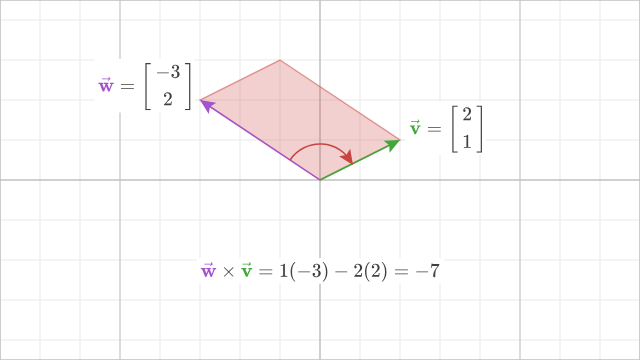

# Точка внутри четырёхугольника



Вводятся координаты четырёх вершин четырёхугольника `(x1, y1), …, (x4, y4)` в порядке обхода (по или против часовой стрелки), затем координаты тестируемой точки `(x, y)`. Все числа вещественные.

При некорректном вводе вывести в `stderr` сообщение `Incorrect input!` и завершить программу с кодом `1`.

### Порядок работы

1. Определить тип четырёхугольника: `Convex`(**выпуклый**) или `Not convex`(**вогнутый**).
2. Если четырёхугольник **выпуклый** — проверить, лежит ли точка внутри (`Inside`) или снаружи (`Outside`). Граница считается «внутри».
3. Если четырёхугольник **не выпуклый** — проверку точки не выполнять.

### Метод

> **Векторное произведение(cross product)** двух векторов на плоскости — это число. Для векторов **v** = (vₓ, vᵧ) и **w** = (wₓ, wᵧ):
>
> ```
> v × w = vₓ * wᵧ - vᵧ * wₓ
> ```
>
> **Смысл:** знак показывает, с какой стороны от направления **v** лежит конец **w** — слева (положительный), справа (отрицательный) или на одной прямой (ноль). По модулю это удвоенная площадь треугольника(трапеция), построенного на векторах **u** и **v**. В задаче это позволяет понять, по какую сторону от стороны многоугольника находится точка, и все ли повороты при обходе вершин идут в одну сторону (выпуклость).

 

## Проверка выпуклости
Обозначим вершины по порядку обхода: **A** `(x1, y1)`, **B** `(x2, y2)`, **C** `(x3, y3)`, **D** `(x4, y4)`. В каждой вершине берём два смежных ребра как векторы и считаем их векторное произведение:

| Проверка | Вершина | Векторы | Переменная в коде |
|----------|---------|---------|-------------------|
| 1 | **B** | **AB** и **BC** | `turnABC` |
| 2 | **C** | **BC** и **CD** | `turnBCD` |
| 3 | **D** | **CD** и **DA** | `turnCDA` |
| 4 | **A** | **DA** и **AB** | `turnDAB` |

На примере вершины **B**:

```
Вектор AB = (x2 - x1, y2 - y1)
Вектор BC = (x3 - x2, y3 - y2)
```

Тогда `turnABC` — это векторное произведение **AB × BC**:

```
turnABC = AB_x * BC_y - AB_y * BC_x
        = (x2 - x1) * (y3 - y2) - (y2 - y1) * (x3 - x2)
```

Таким образом знак `turnABC` определяет угол, он либо больше 180 градусов по часовой стрелке либо меньше. Теперь нужно проверить, что знак сохраняется при переходе к следующим ребрам.

Остальные три поворота считаются так же: `turnBCD` = **BC × CD**, `turnCDA` = **CD × DA**, `turnDAB` = **DA × AB**.

Четырёхугольник **выпуклый**, если знаки всех четырёх поворотов совпадают с `turnABC` (все положительные или все отрицательные). Если `turnABC == 0` — четырёхугольник вырожденный, `Not convex`.

**Пример** — квадрат A`(0,0)` B`(1,0)` C`(1,1)` D`(0,1)` (обход против часовой):

```
AB = (1, 0),  BC = (0, 1)
turnABC = 1 * 1 - 0 * 0 = 1
```

Поворот в **B** — налево, знак положительный. Аналогично `turnBCD`, `turnCDA`, `turnDAB` тоже равны `1` → все знаки совпали → `Convex`.

## Проверка попадания точки
(только для выпуклого четырёхугольника). Для каждой **стороны** и тестовой точки **P** `(x, y)`:

| Сторона | Переменная в коде |
|---------|-------------------|
| A→B | `crossAB` |
| B→C | `crossBC` |
| C→D | `crossCD` |
| D→A | `crossDA` |

Формула для стороны **A→B**:

```
crossAB = (Bx - Ax) * (Py - Ay) - (By - Ay) * (Px - Ax)
```

Точка внутри тогда и только тогда, когда знаки всех четырёх `cross` совпадают с `crossAB` или равны нулю (точка на границе).

### Формат ввода

```
x1 y1 x2 y2 x3 y3 x4 y4 x y
```

### Примеры

Квадрат `(0,0) (1,0) (1,1) (0,1)`, точка `(0.5, 0.5)`:

```
0 0 1 0 1 1 0 1 0.5 0.5
```

```
Convex
Inside
```

Точка снаружи:

```
0 0 1 0 1 1 0 1 2 2
```

```
Convex
Outside
```

Вогнутый четырёхугольник `(0,0) (4,0) (2,3) (2,1)`:

```
0 0 4 0 2 3 2 1 2 0.5
```

```
Not convex
```
