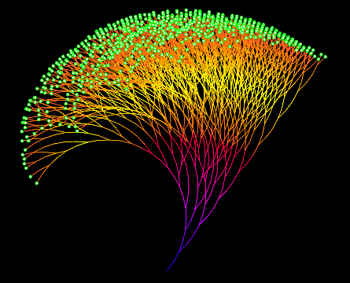

# Последовательность Коллатца




Есть интересное видео на канале Veritasium - [ссылка](https://youtu.be/QgzBDZwanWA?si=T5McGYnYBcR0rUMZ)


Дано число `N`. На каждом шаге:

- если число **чётное** — делим на `2`;
- если **нечётное** — умножаем на `3` и прибавляем `1`.

Посчитать количество шагов до достижения `1`.

При некорректном вводе вывести в `stderr` сообщение `Incorrect input!` и завершить программу с кодом `1`.

> Никто не доказал, что последовательность всегда заканчивается на `1` — но на практике заканчивается.

### Формат ввода

```
N
```

### Примеры

```
6
```

```
8
```

```
1
```

```
0
```
