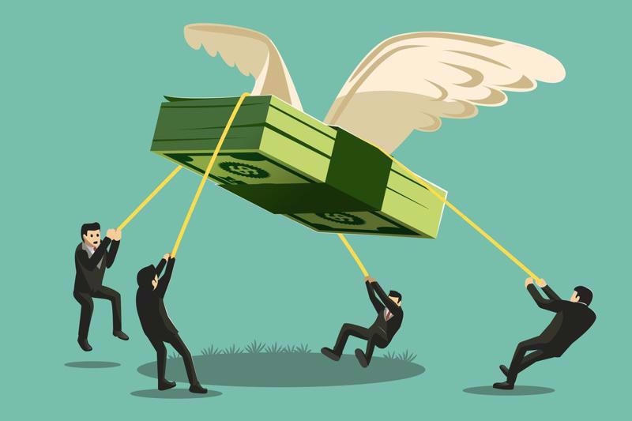

# Через сколько лет удвоятся деньги?



Дана сумма и годовой процент. Симулировать по годам, пока сумма не удвоится. На **каждой итерации** цикла выводить год и баланс.

Затем учесть **инфляцию `5%`**(каждый год): через сколько лет удвоится **реальная** стоимость (покупательная способность)?

При некорректном вводе вывести в `stderr` сообщение `Incorrect input!` и завершить программу с кодом `1`.

### Формат ввода

```
principal rate
```

### Примеры

```
10000 5
```

```
Absolute value:
Year  1: 10500.00
Year  2: 11025.00
Year  3: 11576.25
Year  4: 12155.06
Year  5: 12762.82
Year  6: 13400.96
Year  7: 14071.00
Year  8: 14774.55
Year  9: 15513.28
Year 10: 16288.95
Year 11: 17103.39
Year 12: 17958.56
Year 13: 18856.49
Year 14: 19799.32
Year 15: 20789.28  ← doubled!

Real value with infliation (5%):
Rate is lower than inflation. Your money is gone.
...
```

При ставке `5%` и инфляции `5%` реальная стоимость не растёт — удвоение невозможно.

```
10000 10
```

```
Absolute value:
Year  1: 11000.00
Year  2: 12100.00
Year  3: 13310.00
Year  4: 14641.00
Year  5: 16105.10
Year  6: 17715.61
Year  7: 19487.17
Year  8: 21435.89  ← doubled!

Real value with infliation (5%):
Year  1: 10476.19
Year  2: 10975.06
Year  3: 11497.68
Year  4: 12045.19
Year  5: 12618.77
Year  6: 13219.66
Year  7: 13849.17
Year  8: 14508.65
Year  9: 15199.54
Year 10: 15923.33
Year 11: 16681.58
Year 12: 17475.94
Year 13: 18308.13
Year 14: 19179.95
Year 15: 20093.28  ← doubled!
```
