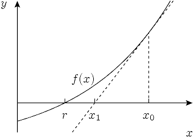

# Квадратный корень методом Ньютона

Реализовать собственную функцию извлечения квадратного корня (замену `sqrt` из `math.h`):

```c
double my_sqrt(double x);
```

Функция вычисляет `√x` **методом Ньютона** — так на самом деле и считаются «встроенные» математические функции.

### Идея метода

Алгоритм начинает с какого-то изначального приближения $x_0$ и затем итеративно строит лучшее решение, строя касательную к графику в точке $x=x_i$ и присваивая в качестве следующего приближения $x_{i+1}$ координату пересечения касательной с осью $x$. Интуиция в том, что если функция f «хорошая», и 
$x_i$ уже достаточно близок к **корню**($f(x)=0$ пересечение с осью x), то $x_{i+1}$ будет ещё ближе.



Чтобы получить точку пересечения для $x_{i}$ нужно приравнять уравнение касательной к нулю:

$$ 0 = f(x_i)+(x_{i+1}-x_{i})*f'(x_i) $$
отсюда
$$ x_{i+1} = x_i - \frac{f(x_i)}{f'(x_i)} $$

## Поиск квадратных корней


В качестве конкретного примера рассмотрим задачу нахождения квадратных корней, которую можно переформулировать как решение следующего уравнения:

$x = \sqrt{n} \implies x^2 = n \implies f(x) = x^2-n = 0$

По методу Ньютона мы получаем следующее правило(производная $x^2=2x$)
$$x_{i+1} = x_{i} -\frac{x_{i}^2 - n}{2x_{i}} = \frac{x_i+n/x_{i}}{2} $$

В целом формула для программирования
```
x_next = (x_prev + n/ x_prev) / 2
```

Каждая итерация приближает `g` к настоящему значению корня.

### Неочевидное: сходимость

Мы **не знаем заранее**, сколько итераций понадобится. Поэтому повторяем шаг до тех пор, пока изменение приближения не станет меньше маленького `epsilon`:

```
|g_next - g| < EPSILON   →   останавливаемся
```

Это и есть **сходимость**: последовательность приближений всё медленнее меняется и «сходится» к ответу. `EPSILON` (например `1e-9`) задаёт требуемую точность.

### Страховка: MAX_ITER

Цикл «пока не сошлось» опасен: если метод по какой-то причине не сходится, программа зациклится навсегда. Поэтому вводим глобальную константу `MAX_ITER` — максимально допустимое число итераций. Если за `MAX_ITER` шагов сходимости не достигли, выводим сообщение в `stderr` и завершаемся с кодом `1`.

### Подводные камни

- `x < 0` — корня в вещественных числах нет, это некорректный ввод.
- `x == 0` — корень равен `0` (обрабатываем отдельно, чтобы не делить на ноль).

### Формат ввода

```
x
```

### Примеры

```
9
```

```
3.000000
```

---

```
2
```

```
1.414214
```

---

```
0
```

```
0.000000
```
