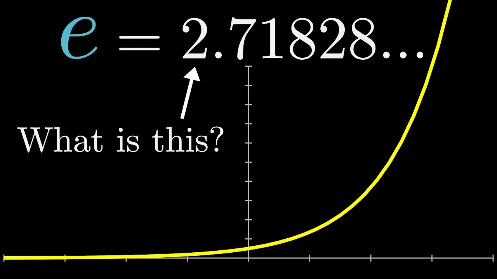

# Приближение π и e рядами



```
Для любопытных посмотрите видео на 3blue1brown
```
[видео](https://www.youtube.com/watch?v=m2MIpDrF7Es)

Многие константы можно вычислить как сумму бесконечного ряда. На практике мы берём **конечное** число слагаемых `N` и получаем приближение. Реализуем две функции и сравним, насколько быстро каждый ряд приближается к ответу.

```c
double my_e(int terms);
double my_pi_leibniz(int terms);
```

### Ряд для e (Тейлор)

```
e = 1 + 1/1! + 1/2! + 1/3! + ...
```

Знаменатель — факториал, поэтому слагаемые **очень быстро** становятся крошечными. Ряд сходится стремительно: уже ~18 слагаемых дают все 15 знаков `double`.

Считать факториал в лоб не нужно — каждое следующее слагаемое получается из предыдущего делением:

```
term_0 = 1        (= 1/0!)
term_{i+1} = term_i / (i + 1)
```

### Ряд Лейбница для π

```
π = 4 * (1 - 1/3 + 1/5 - 1/7 + 1/9 - ...)
```

Знаки чередуются, знаменатель растёт лишь линейно (`1, 3, 5, ...`), поэтому ряд сходится **мучительно медленно**: чтобы получить `k` верных знаков, нужно порядка `10^k` слагаемых.

### Что обсудить: точность и скорость сходимости

Запустив программу с одним и тем же `N`, видно разницу:

- `e` — ошибка падает как факториал, точность достигается за единицы слагаемых;
- `π` (Лейбниц) — ошибка падает как `~1/N`, для 6 знаков нужны миллионы слагаемых.

Вывод: **сам факт сходимости ряда ничего не говорит о её скорости**. Ряд может быть математически верным, но практически бесполезным без ускорения.

### Формат ввода

```
N
```

`N` — число слагаемых (`N >= 1`).

### Пример

```
10
```

```
e  ≈ 2.718281525573192  (истинное 2.718281828459045, ошибка 3.03e-07)
pi ≈ 3.041839618929403  (истинное 3.141592653589793, ошибка 9.98e-02)
```

За 10 слагаемых `e` точен уже до 6 знака, а `π` — лишь до первого.
