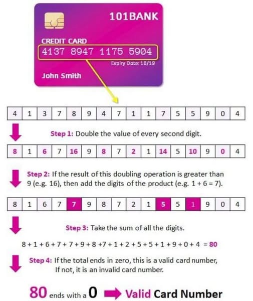

# Алгоритм Луна — проверка номера карты



Реализовать функцию проверки номера банковской карты (или любого числа) по **алгоритму Луна**:

```c
int luhn_check(long long number);
```

Возвращает `1`, если контрольная сумма сходится (номер корректен), иначе `0`.

### Как работает алгоритм

Идём по цифрам числа **справа налево**:

1. Каждую **вторую** цифру (начиная со второй справа) **удваиваем**.
2. Если удвоенная цифра больше `9` — **вычитаем 9** (это то же самое, что сложить её две цифры: `16 → 1+6 = 7 = 16-9`).
3. Складываем все получившиеся цифры.
4. Номер корректен, если итоговая сумма **делится на 10** без остатка.

### Пример

Номер `7992739871**3**`, обрабатываем справа:

```
цифра:   7  9  9  2  7  3  9  8  7  1  3
позиция: 10 9  8  7  6  5  4  3  2  1  0   (справа, с нуля)
удвоить:    x     x     x     x     x      (нечётные позиции)
результат:
  3          -> 3
  1  *2 = 2  -> 2
  7          -> 7
  8  *2 =16  -> 16-9 = 7
  9          -> 9
  3  *2 = 6  -> 6
  7          -> 7
  2  *2 = 4  -> 4
  9          -> 9
  9  *2 =18  -> 18-9 = 9
  7          -> 7
сумма = 3+2+7+7+9+6+7+4+9+9+7 = 70  ->  70 % 10 == 0  ->  корректно
```

### Почему без массивов

Цифры не нужно где-то хранить: перебираем их «на лету» операциями `number % 10` (последняя цифра) и `number /= 10` (отбросить её). Достаточно счётчика позиции и накопителя суммы.

### Формат ввода

```
number
```

`number` — номер карты как целое число (`> 0`, до 18–19 цифр — тип `long long`).

### Примеры

```
79927398713
```

```
1
```

---

```
79927398714
```

```
0
```

---

```
4539148803436467
```

```
1
```
