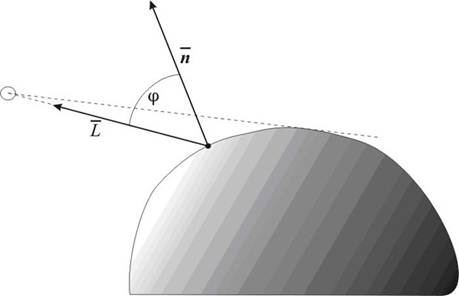

# Освещённость грани: скалярное произведение и модель Ламберта

Настоящая формула из любого 3D-движка. Освещённость (яркость) грани по **модели Ламберта** пропорциональна косинусу угла между **нормалью грани** `N` и **направлением на источник света** `L`. Чем «прямее» свет падает на грань — тем она ярче.

Реализовать функции (векторы передаём тремя числами `x, y, z` — массивы не нужны):

```c
double dot(double ax, double ay, double az, double bx, double by, double bz);
double length(double x, double y, double z);
double angle_deg(double nx, double ny, double nz, double lx, double ly, double lz);
double lambert(double nx, double ny, double nz, double lx, double ly, double lz);
```

### Скалярное произведение

```
N · L = Nx*Lx + Ny*Ly + Nz*Lz
```

### Косинус угла между векторами

```
cos(угол) = (N · L) / (|N| * |L|)          где |V| = sqrt(Vx² + Vy² + Vz²)
```

### Яркость по Ламберту



```
яркость = max(0, cos(угол))
```

`max(0, ...)` важен: если грань **отвёрнута** от света (угол больше 90°, косинус отрицательный), она не может освещаться «с обратной стороны» — яркость равна `0`, а не отрицательному числу.

### Подводный камень: acos
Так как из косинуса нужно получить обратно угол в радианах, то за это отвечает обратная функция **acos** но результат будет в радианах(читайте [cppreference](https://cppreference.com/c/numeric/math/acos))

Из-за погрешностей `double` величина `cos(угол)` может получиться, например, `1.0000000002`. Тогда `acos` вернёт `nan`. Поэтому перед `acos` косинус **зажимают** в диапазон `[-1, 1]`.

### Формат ввода

Шесть чисел: сначала нормаль `N`, затем направление на свет `L`.

```
Nx Ny Nz Lx Ly Lz
```

Ни один из векторов не должен быть нулевым (иначе угол не определён).

### Примеры

Свет строго вдоль нормали — грань освещена полностью:

```
0 0 1 0 0 1
```

```
dot = 1.000000
angle = 0.000000 deg
brightness = 1.000000
```

---

Свет под 90° — грань на границе света и тени:

```
0 0 1 1 0 0
```

```
dot = 0.000000
angle = 90.000000 deg
brightness = 0.000000
```

---

Свет отвёрнут от грани — темно (яркость обрезана до 0):

```
0 0 1 0 0 -1
```

```
dot = -1.000000
angle = 180.000000 deg
brightness = 0.000000
```
