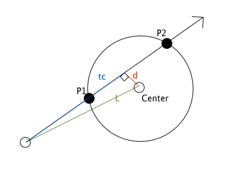

# Пересечение луча со сферой (raycasting)

Сердце трассировки лучей: узнать, попадает ли **луч** в **сферу**, и если да — на каком расстоянии. Вся задача сводится к решению **квадратного уравнения**.

Реализовать функцию:

```c
int intersect_sphere(double ox, double oy, double oz,   // начало луча O
                     double dx, double dy, double dz,   // направление луча D
                     double cx, double cy, double cz,   // центр сферы C
                     double r,                           // радиус сферы
                     double *t);                         // сюда пишем расстояние до попадания
```

Возвращает `1`, если луч пересекает сферу впереди себя, и записывает в `*t` расстояние до **ближайшего** пересечения. Иначе возвращает `0`.

### Вывод формулы



Точка на луче: `P(t) = O + t·D`, где `t >= 0` — расстояние вдоль луча.

Точка на сфере: `|P - C|² = r²`.

Подставляем `P(t)` и раскрываем. Обозначим `OC = O - C`. Получаем квадратное уравнение относительно `t`:

```
a·t² + b·t + c = 0

a = D · D
b = 2 · (OC · D)
c = (OC · OC) - r²
```

(здесь `·` — скалярное произведение).

### Дискриминант решает всё

```
disc = b² - 4·a·c
```

- `disc < 0` — корней нет, луч **проходит мимо** сферы;
- `disc >= 0` — есть пересечения на расстояниях `t = (-b ± sqrt(disc)) / (2a)`.

Из двух корней `t0 <= t1` берём **ближайший неотрицательный**:

- `t0 >= 0` → попадание на входе в сферу (`t = t0`);
- иначе `t1 >= 0` → начало луча **внутри** сферы, берём выход (`t = t1`);
- оба отрицательны → сфера **позади** луча — мимо.

### Формат ввода

Десять чисел: начало луча, направление, центр сферы, радиус.

```
Ox Oy Oz  Dx Dy Dz  Cx Cy Cz  r
```

### Примеры

Луч из начала координат прямо на сферу:

```
0 0 0  0 0 1  0 0 5  1
```

```
Hit! t = 4.000000
point = (0.000000, 0.000000, 4.000000)
```

---

Луч мимо сферы:

```
0 0 0  0 1 0  0 0 5  1
```

```
Miss
```

---

Начало луча внутри сферы — берётся точка выхода:

```
0 0 5  0 0 1  0 0 5  1
```

```
Hit! t = 1.000000
point = (0.000000, 0.000000, 6.000000)
```
