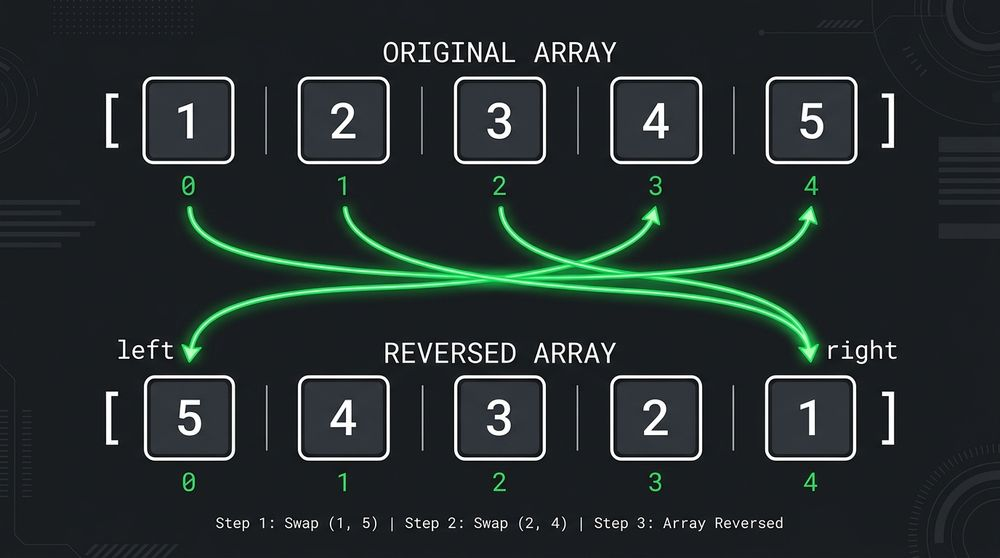

# Разворот массива на месте (in-place)



Реализовать функцию, которая разворачивает массив `int a[]` **на месте
(in-place)** — не заводя второй массив:

```c
void reverse(int a[], size_t n);
```

Например:

```
{1, 2, 3, 4, 5}  ->  {5, 4, 3, 2, 1}
{10, 20}         ->  {20, 10}
{42}             ->  {42}
```

### Требования

- Разворот **на месте**: без вспомогательного массива, только обмен элементов
  внутри `a` (без дополнительной памяти).
- Аккуратно с краями: `n == 0` и `n == 1` — массив уже «развёрнут», обменов нет.
  Помни, что `size_t` беззнаковый: `n - 1` при `n == 0` даёт огромное число.

### Формат ввода

```
N
a0 a1 ... a(N-1)
```

Программа читает количество `N`, затем `N` целых чисел, вызывает `reverse`
и печатает получившийся массив в одну строку через пробел.

### Примеры

Готовые файлы ввода лежат рядом с заданием: `./a.out < basic.txt`.

**[basic.txt](basic.txt)**

```
5
1 2 3 4 5
```

```
5 4 3 2 1
```

---

**[single.txt](single.txt)**

```
1
42
```

```
42
```

---

**[negative.txt](negative.txt)**

```
4
-1 -2 -3 -4
```

```
-4 -3 -2 -1
```

---

**[empty.txt](empty.txt)**

```
0
```

```

```

---

**[even.txt](even.txt)**

```
6
10 20 30 40 50 60
```

```
60 50 40 30 20 10
```

---

**[two.txt](two.txt)**

```
2
10 20
```

```
20 10
```
