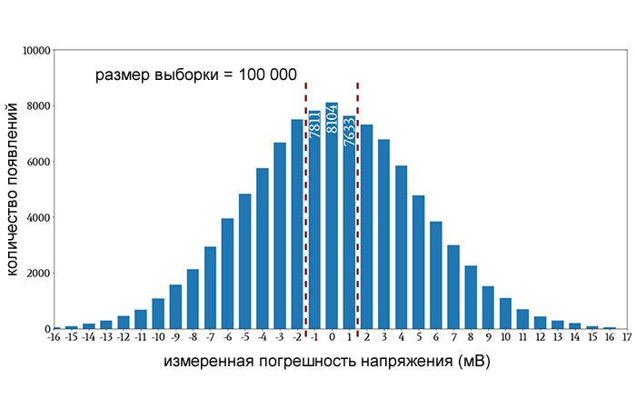

# Гистограмма по корзинам



Дан массив `double data[]`. Разложить значения по `B` корзинам **равной ширины**
на отрезке `[min, max]` самих данных и заполнить `int bins[B]`, где `bins[k]` —
сколько значений попало в корзину `k`:

```c
void histogram(const double data[], size_t n, size_t b, int bins[]);
```

Границы **не даны** — минимум и максимум найди сам по массиву.

Например (`B = 2`, данные лежат на `[0, 2]`):

```
data = {0.0, 0.5, 1.0, 1.5, 2.0}  ->  bins = {2, 3}
```

### Требования

- Сначала найди границы: `lo = min(data)`, `hi = max(data)`.
- `B` корзин равной ширины, вместе покрывающих `[lo, hi]`.

> Формулу номера корзины по значению `x` выведите сами.

### Формат ввода

```
N
x0 x1 ... x(N-1)
B
```

Программа читает `N` чисел `double` и число корзин `B`, находит `[min, max]`
сама и печатает `B` строк вида `k: bins[k]`.

### Примеры

```
5
0.0 0.5 1.0 1.5 2.0
2
```

```
0: 2
1: 3
```

---

```
3
5 5 5
4
```

```
0: 3
1: 0
2: 0
3: 0
```
