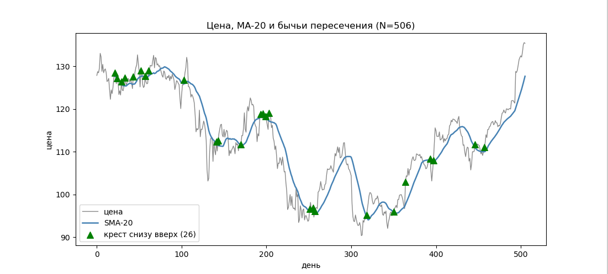

# Скользящее среднее и «золотой крест»



Дан массив `double price[]` — дневные котировки акции. Построить **простое
скользящее среднее** (SMA) с окном `w` и отметить дни, когда цена пересекает
своё скользящее среднее **снизу вверх** — мини-версия «золотого креста»
(бычий сигнал).

## Что такое скользящее среднее

Скользящее среднее (SMA, Simple Moving Average) сглаживает шум в ряду цен и
показывает тренд. Значение в день `i` — это среднее `w` последних цен, включая
текущую:

```
SMA[i] = (price[i-w+1] + price[i-w+2] + ... + price[i]) / w
```

- Определено только с дня `i = w - 1`: до этого в окне меньше `w` значений
  (для первых `w-1` дней SMA не существует).
- Чем больше окно `w`, тем сильнее сглаживание. `MA-20` = среднее по 20 дням.

Пример (`w = 3`):

```
price:  10    12    11    13    15
SMA:     ·     ·   11.0  12.0  13.0     (· — окна ещё нет)
```

## Сигнал: пересечение снизу вверх


Цена, шедшая ниже своего среднего, пробивает его вверх — это считают бычьим
сигналом. День `i` помечаем, если

```
price[i-1] < SMA[i-1]   и   price[i] > SMA[i]
```

(вчера цена была под средним, сегодня — над ним). Нужны определённые `SMA[i-1]`
и `SMA[i]`, поэтому проверять начинаем с дня `i = w`.

## Функции

```c
void moving_average(const double price[], size_t n, size_t w, double sma[]);
size_t golden_crosses(const double price[], const double sma[], size_t n, size_t w, size_t days[]);
```

- `moving_average` заполняет `sma[i]` для `i >= w-1`; для первых `w-1` дней
  кладёт `NAN` (не определено).
- `golden_crosses` пишет индексы дней-сигналов в `days[]` и возвращает их число.

### Требования / подсказки

- Окно считай **скользящей суммой** за один проход O(n): прибавляй новый
  элемент, вычитай вышедший из окна.
- Сравнение строгое (`<`, `>`): «касание» средним за пересечение не считаем.
- Гарантируется `1 <= w <= N`.

## Формат ввода

```
N
p0 p1 ... p(N-1)
w
```

Программа печатает число сигналов, а на следующей строке — индексы дней через
пробел (пустая строка, если сигналов нет).

## Примеры

```
5
10 9 8 11 12
3
```

```
1
3
```
