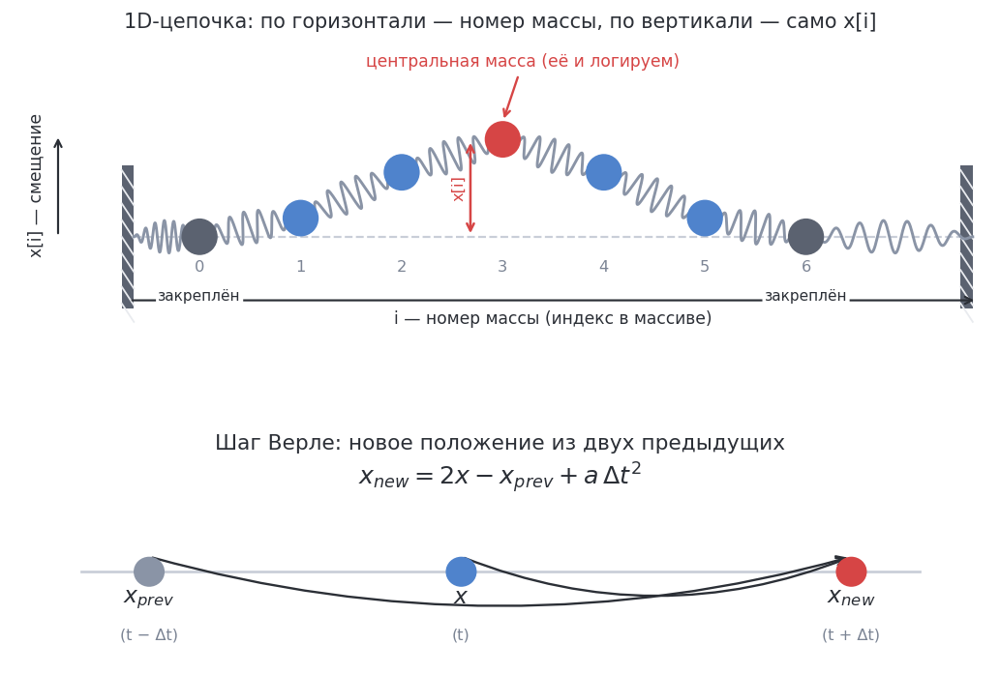

# Симуляция «пружинок» 1D (интегрирование Верле)



Цепочка из `N` масс на пружинах в 1D. Массы стоят в ряд, соседние соединены
одинаковыми пружинами, **концы закреплены** (`x[0]` и `x[N-1]` не двигаются).
Нужно проинтегрировать движение методом Верле и записать положение
**центральной массы** `x[N/2]` на каждом из первых `STEPS` шагов в `double log[STEPS]`.

## Что такое интегрирование Верле

Обычно шаг по времени требует знать положение и скорость. Метод Верле
обходится **двумя предыдущими положениями** — текущим `x` и прошлым `x_prev`:

```
x_new = 2*x - x_prev + a * dt*dt
```

Формула получается сложением разложений Тейлора для `x(t+dt)` и `x(t-dt)`:
скорость сокращается, остаётся ускорение `a`. Метод простой и хорошо сохраняет
энергию (колебания не «раскачиваются» и не затухают искусственно).

## Сила пружин

Ускорение массы `i` задаётся соседями (берём жёсткость и массу равными 1):

```
a[i] = x[i-1] + x[i+1] - 2*x[i]
```

Это «тянущая к соседям» сила: если масса выбилась из линии, соседи возвращают её
назад. Концы `i = 0` и `i = N-1` фиксированы — их не пересчитываем.

## Шаг симуляции

1. Для каждой внутренней массы `i = 1..N-2` посчитать `x_new[i]` по формуле Верле
   (нужен отдельный массив: `x[i-1]`, `x[i+1]` должны быть ещё старыми).
2. Концы скопировать без изменений.
3. Сдвинуть состояние: `x_prev <- x`, `x <- x_new`.
4. Записать `log[s] = x[N/2]` — положение центральной массы после шага `s`.

Старт из покоя: до первого шага `x_prev = x` (нулевая скорость) — это делает `main`.

## Функция

```c
void simulate(double x[], double x_prev[], size_t n, size_t steps, double dt, double log[]);
```

### Требования / подсказки

- Концы всегда неподвижны.
- `dt` держи небольшим (например `0.1`): при слишком большом шаге схема
  становится неустойчивой и значения улетают в бесконечность.
- Гарантируется `N >= 3` (нужна хотя бы одна внутренняя масса).

## Формат ввода

```
N
x0 x1 ... x(N-1)
STEPS dt
```

Программа читает начальные положения `x`, число шагов `STEPS` и шаг `dt`, затем
печатает `STEPS` строк — положение центральной массы (по одному `%.6f` в строке).

## Пример

```
3
0 1 0
3
0.1
```

```
0.980000
0.940400
0.881992
```

Центр (масса 1) тянется двумя пружинами к нулю и начинает колебаться — за первые
шаги медленно идёт вниз, как начало косинуса.
