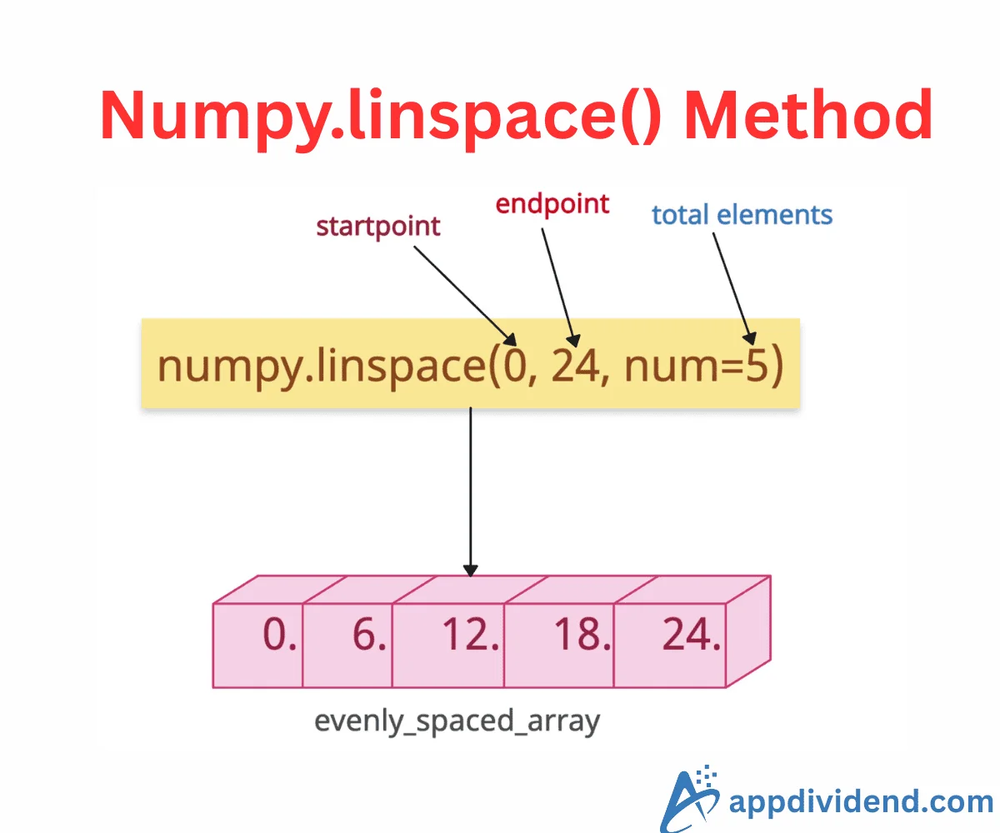

# Равномерная сетка на куче (linspace)



Реализовать функцию, которая **выделяет** массив из `n` точек, равномерно
распределённых на отрезке `[start, stop]` (оба конца включены) — аналог
`numpy.linspace`:

```c
double *linspace(double start, double stop, size_t n);
```


Например:

```
linspace(0, 1, 5)   ->  {0, 0.25, 0.5, 0.75, 1}
linspace(-1, 1, 3)  ->  {-1, 0, 1}
linspace(3, 7, 1)   ->  {3}
```

### Требования

- Память под `n` элементов брать `malloc`, результат проверять на `NULL`
  (не хватило памяти — вернуть `NULL`). Освобождать в `main` через `free`.
- Считать `a[i] = start + i * step`, **а не** накоплением `x += step`: при
  накоплении ошибка округления копится от элемента к элементу.
- Края точные: `a[0] == start`, `a[n-1] == stop` — последний элемент присвоить
  явно, не полагаясь на арифметику.
- `n == 1` — один элемент `start`, деления на `n - 1 == 0` быть не должно.
- `n == 0` — вернуть `NULL`, ничего не выделяя.

### Формат ввода

```
start stop n
```

Программа читает два вещественных числа и количество точек `n`, вызывает
`linspace` и печатает массив в одну строку через пробел (пустая строка при
`n == 0`).

### Примеры

```
0 1 5
```

```
0 0.25 0.5 0.75 1
```

---

```
10 0 6
```

```
10 8 6 4 2 0
```

---

```
3 7 1
```

```
3
```
