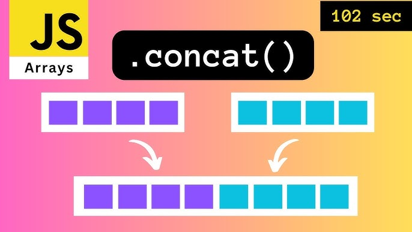

# Склейка двух массивов (concat)



Реализовать функцию, которая **выделяет** новый массив длины `na + nb` и
копирует в него сначала все элементы `a`, затем все элементы `b`:

```c
int *concat(const int *a, size_t na, const int *b, size_t nb);
```

Например:

```
concat({1, 2, 3}, 3, {4, 5}, 2)  ->  {1, 2, 3, 4, 5}
concat({}, 0, {7, 8}, 2)         ->  {7, 8}
concat({}, 0, {}, 0)             ->  {}
```

### Требования

- Исходные массивы не меняем (оба `const`), результат — отдельный блок памяти.
- Память брать `malloc` на `na + nb` элементов, результат проверять на `NULL`.
  Освобождать в `main` через `free`.
- Хвост писать со смещением: копия `b` начинается с `res + na`.
- `na + nb == 0` — вернуть `NULL`, ничего не выделяя.
- Пустую часть не копировать: при `na == 0` (или `nb == 0`) указатель может
  быть `NULL`, а `memcpy` с `NULL` — неопределённое поведение даже при нулевой
  длине.

### Формат ввода

```
NA
a0 a1 ... a(NA-1)
NB
b0 b1 ... b(NB-1)
```

Программа печатает склеенный массив в одну строку через пробел (пустая строка,
если оба массива пусты).

### Примеры

Готовые файлы ввода лежат рядом с заданием: `./a.out < basic.txt`.

**[basic.txt](basic.txt)**

```
3
1 2 3
2
4 5
```

```
1 2 3 4 5
```

---

**[empty_a.txt](empty_a.txt)**

```
0

2
7 8
```

```
7 8
```

---

**[both_empty.txt](both_empty.txt)**

```
0

0

```

(пустой вывод)

---

**[empty_b.txt](empty_b.txt)**

```
3
1 2 3
0

```

```
1 2 3
```

---

**[negatives.txt](negatives.txt)**

```
3
-1 -2 -3
3
-4 -5 -6
```

```
-1 -2 -3 -4 -5 -6
```

---

**[same.txt](same.txt)**

```
4
5 5 5 5
4
5 5 5 5
```

```
5 5 5 5 5 5 5 5
```

---

**[single.txt](single.txt)**

```
1
42
1
-42
```

```
42 -42
```
