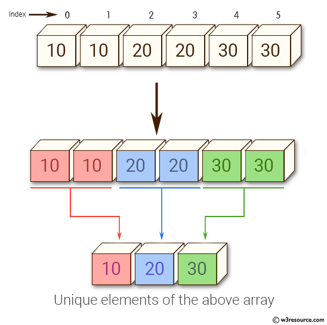

# Уникальные элементы (unique)



Реализовать функцию, которая **выделяет** новый массив и кладёт в него
уникальные элементы исходного — в порядке первого появления. Количество
возвращается через `out_n`:

```c
int *unique(const int *a, size_t n, size_t *out_n);
```

Например:

```
{3, 1, 3, 2, 1}  ->  {3, 1, 2}      *out_n = 3
{5, 5, 5}        ->  {5}            *out_n = 1
{}               ->  NULL           *out_n = 0
```

### Требования

- Порядок первого появления, исходный массив не меняем и не сортируем.
- Сколько будет уникальных — заранее неизвестно, поэтому выделяем `n`
  элементов (худший случай), заполняем, а в конце ужимаем блок до реального
  размера через `realloc`.
- Результат `realloc` класть во временную переменную: если он вернул `NULL`,
  старый блок всё ещё жив и рабочий.
- Проверять `malloc` на `NULL`; при неудаче — `*out_n = 0` и `NULL`.
- `n == 0` — вернуть `NULL`, `*out_n = 0`, ничего не выделяя.
- Освобождать в `main` через `free`.

### Формат ввода

```
N
a0 a1 ... a(N-1)
```

Программа печатает количество уникальных, а на следующей строке — сами
элементы через пробел.

### Примеры

Готовые файлы ввода лежат рядом с заданием: `./a.out < basic.txt`.

**[scattered.txt](scattered.txt)**

```
5
3 1 3 2 1
```

```
3
3 1 2
```

---

**[all_same.txt](all_same.txt)**

```
4
7 7 7 7
```

```
1
7
```

---

**[all_distinct.txt](all_distinct.txt)**

```
5
1 2 3 4 5
```

```
5
1 2 3 4 5
```

---

**[alternating.txt](alternating.txt)**

```
8
1 2 1 2 1 2 1 2
```

```
2
1 2
```

---

**[basic.txt](basic.txt)**

```
8
1 1 1 2 1 1 2 3
```

```
3
1 2 3
```

---

**[empty.txt](empty.txt)**

```
0

```

```
0

```

---

**[negatives.txt](negatives.txt)**

```
6
-1 2 -1 0 2 0
```

```
3
-1 2 0
```

---

**[single.txt](single.txt)**

```
1
42
```

```
1
42
```
