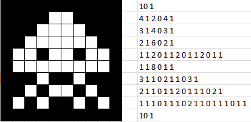

# Кодирование длин серий (RLE)



RLE (run-length encoding) заменяет подряд идущие одинаковые элементы парой
«значение + сколько раз». Реализовать кодирование и обратное декодирование:

```c
int rle(const int *a, size_t n, int **out_vals, int **out_runs, size_t *out_n);
int *rle_decode(const int *vals, const int *runs, size_t n, size_t *out_n);
```

Например:

```
{4, 4, 4, 7, 1, 1}  ->  vals = {4, 7, 1}
                        runs = {3, 1, 2}   *out_n = 3

vals = {5, 9}, runs = {2, 3}  ->  {5, 5, 9, 9, 9}   *out_n = 5
```

### Требования

- `rle` выделяет **два** массива по числу серий и отдаёт их через `out_vals` и
  `out_runs`; возвращает `0` при успехе и `-1`, если память не дали (тут `int` —
  код возврата, а не «да/нет»).
- Если вторая аллокация не удалась — освободить первую и вернуть `-1`, иначе
  утечка. На всех неудачных путях `*out_vals = *out_runs = NULL`, `*out_n = 0`.
- Число серий можно посчитать первым проходом — тогда `malloc` сразу нужного
  размера, без `realloc`.
- `rle_decode` выделяет массив длиной `runs[0] + ... + runs[n-1]`, размер
  отдаёт через `*out_n`. Длина серии обязана быть положительной: если
  `runs[i] <= 0` — вернуть `NULL`.
- `n == 0` — ничего не выделять: `*out_n = 0`, указатели `NULL` (для `rle` это
  не ошибка, возврат `0`).
- Освобождать в `main` через `free` — все три массива.

### Формат ввода

```
N
a0 a1 ... a(N-1)
```

Программа печатает число серий, строку значений, строку длин, а затем
раскодированный обратно массив — он должен совпасть с исходным.

### Примеры

```
6
4 4 4 7 1 1
```

```
3
4 7 1
3 1 2
4 4 4 7 1 1
```

---

```
3
1 2 3
```

```
3
1 2 3
1 1 1
1 2 3
```
