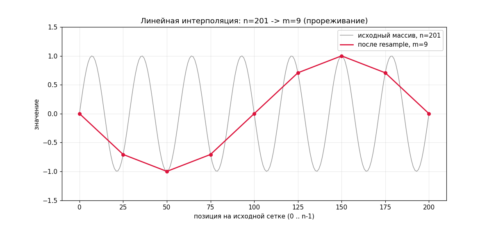

# Ресемплинг (линейная интерполяция)



Реализовать функцию, которая **выделяет** массив из `m` элементов и растягивает
(или сжимает) в него исходный массив длины `n`, интерполируя значения линейно:

```c
double *resample(const double *a, size_t n, size_t m);
```

Выходной отсчёт `j` попадает на исходную сетку в точку

```
pos = j * (n - 1) / (m - 1)
i = (size_t)pos          frac = pos - i
res[j] = a[i] + frac * (a[i + 1] - a[i])
```

Например:

```
resample({0, 10}, 2, 5)     ->  {0, 2.5, 5, 7.5, 10}
resample({0, 1, 2, 3}, 4, 2)->  {0, 3}
resample({4}, 1, 3)         ->  {4, 4, 4}
```

### Требования

- Память брать `malloc` на `m` элементов, результат проверять на `NULL`.
  Освобождать в `main` через `free`. Исходный массив не меняем (`const`).
- Края точные: `res[0] == a[0]`, `res[m-1] == a[n-1]`. На правом краю соседа
  `a[i+1]` уже нет — читать его нельзя.
- `n == 1` или `m == 1` — интерполировать нечем, все элементы равны `a[0]`.
- `n == 0` или `m == 0` — вернуть `NULL`, ничего не выделяя.
- **Проверить:** при `m == n` сетки совпадают, `frac` всюду `0` — результат
  обязан быть точной копией исходного массива (в решении это `assert` с
  `memcmp`).

### Формат ввода

```
N
a0 a1 ... a(N-1)
M
```

Программа печатает получившийся массив из `M` чисел в одну строку через пробел.

### Примеры

```
2
0 10
5
```

```
0 2.5 5 7.5 10
```

---

```
4
0 1 2 3
4
```

```
0 1 2 3
```
