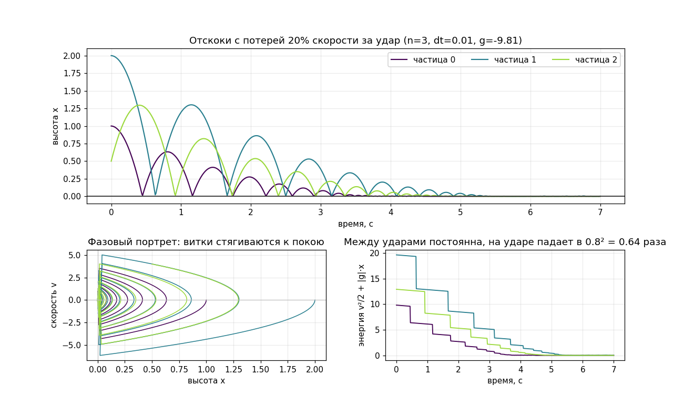

# Ансамбль частиц



Состояние `n` частиц хранится в **двух параллельных массивах** `double`:
`x[i]` — высота i-й частицы, `v[i]` — её скорость. i-я частица
описывается парой `x[i]`, `v[i]`.

Реализовать один шаг явного метода Эйлера для всего ансамбля:

```c
void step_euler(double *x, double *v, size_t n, double dt, double g);
```

Шаг для каждой частицы:

```
v[i] += g * dt        // ускорение меняет скорость
x[i] += v[i] * dt     // скорость двигает частицу
```

Пол на нуле: если частица оказалась ниже, она отскакивает — координата
отражается, скорость меняет знак и гасится:

```
x[i] < 0  ->  x[i] = -x[i],  v[i] = -0.8 * v[i]
```

Коэффициент `0.8` — доля скорости, остающаяся после удара (часть энергии
уходит в удар), поэтому прыжки со временем затухают.

### Требования

- Функция меняет оба массива **на месте** и ничего не выделяет.
- `n` и число шагов известны только во время выполнения, поэтому массивы
  выделяются в `main` через `malloc` — статического буфера тут нет.
- Две аллокации: если вторая не удалась, освободить первую.
- Освобождать оба массива через `free`.
- Обновлять именно в таком порядке: сначала скорость, потом координата уже
  новой скоростью (это полунеявный Эйлер — он не разгоняет частицы из ничего).
- Проверку пола делать после сдвига, для каждой частицы отдельно.

### Формат ввода

```
N
x0 v0
x1 v1
...
STEPS DT G
```

Частицы начинают над полом (`x >= 0`), `G` — ускорение (для падения
отрицательное, например `-9.81`). Программа делает `STEPS` шагов и печатает
две строки: координаты всех частиц и их скорости.

### Примеры

Одна частица падает с высоты 1 без начальной скорости, 10 шагов по 0.1 c —
на пятом шаге она успевает удариться о пол и отскочить:

```
1
1.0 0.0
10 0.1 -9.81
```

```
0.9620
-0.9810
```

---

Без гравитации частицы просто едут с постоянной скоростью:

```
2
0.0 1.0
5.0 -1.0
10 0.1 0.0
```

```
1.0000 4.0000
1.0000 -1.0000
```
