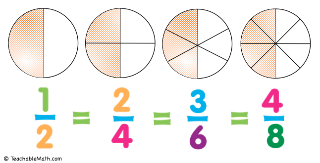

# Рациональная дробь



Дробь хранится в структуре из `fraction.h`:

```c
struct fraction {
    int num;
    int den;
};
```

Реализовать в `fraction.c` четыре функции:

```c
struct fraction fraction_reduce(struct fraction f);
struct fraction fraction_add(struct fraction a, struct fraction b);
struct fraction fraction_mul(struct fraction a, struct fraction b);
void fraction_print(struct fraction f);
```

- `fraction_reduce` — сократить дробь на НОД (алгоритм Евклида, урок 008).
  Знаменатель остаётся положительным, минус уходит в числитель, ноль
  приводится к `0/1`.
- `fraction_add` — привести к общему знаменателю `a.den * b.den`, сократить.
- `fraction_mul` — перемножить числители и знаменатели, сократить.
- `fraction_print` — напечатать `num/den`, а при `den == 1` только числитель,
  без перевода строки.

### Требования

- Дробь маленькая, поэтому передаётся и возвращается по значению.
- Аргументы не менять: каждая функция возвращает новую дробь.
- Сумма и произведение всегда сокращены — вызывать `fraction_reduce`.
- НОД вынести во вспомогательную функцию со `static`: наружу она не нужна.(**static** делает функцию видимой только в **СВОЕЙ** единице трансляции)
- Числа в тестах небольшие, про переполнение `int` можно не думать.

### Сборка

```sh
gcc -Wall -Wextra -std=c17 main.c fraction.c -o app
./app < basic.txt
```

### Формат ввода

Две строки, в каждой числитель и знаменатель:

```
NUM_A DEN_A
NUM_B DEN_B
```

Знаменатель не может быть нулём. Программа печатает две строки: сумму и
произведение.

### Примеры

Готовые файлы ввода лежат рядом с заданием: `./a.out < basic.txt`.

**[reduce.txt](reduce.txt)**

```
2 4
3 6
```

```
1/2 + 1/2 = 1
1/2 * 1/2 = 1/4
```

---

**[negative_den.txt](negative_den.txt)**

```
3 -4
1 2
```

```
-3/4 + 1/2 = -1/4
-3/4 * 1/2 = -3/8
```

---

**[basic.txt](basic.txt)**

```
1 2
1 3
```

```
1/2 + 1/3 = 5/6
1/2 * 1/3 = 1/6
```

---

**[big.txt](big.txt)**

```
999 1000
1 1000
```

```
999/1000 + 1/1000 = 1
999/1000 * 1/1000 = 999/1000000
```

---

**[negatives.txt](negatives.txt)**

```
-2 3
1 4
```

```
-2/3 + 1/4 = -5/12
-2/3 * 1/4 = -1/6
```

---

**[opposite.txt](opposite.txt)**

```
1 3
-1 3
```

```
1/3 + -1/3 = 0
1/3 * -1/3 = -1/9
```

---

**[same.txt](same.txt)**

```
1 6
1 6
```

```
1/6 + 1/6 = 1/3
1/6 * 1/6 = 1/36
```

---

**[whole.txt](whole.txt)**

```
4 2
6 3
```

```
2 + 2 = 4
2 * 2 = 4
```

---

**[zero.txt](zero.txt)**

```
0 5
2 3
```

```
0 + 2/3 = 2/3
0 * 2/3 = 0
```
