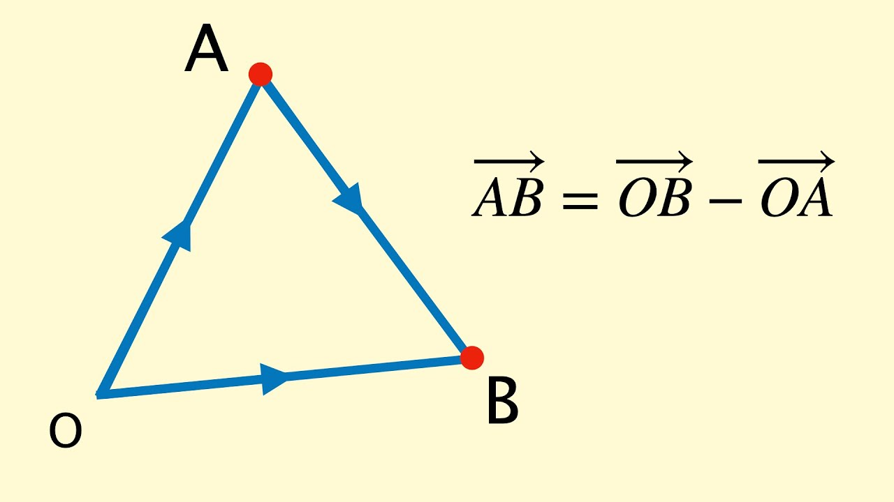
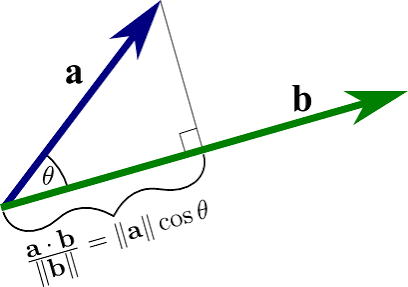
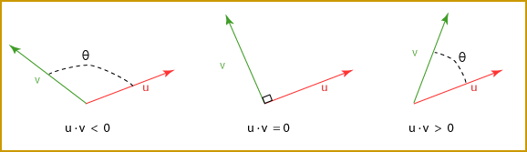
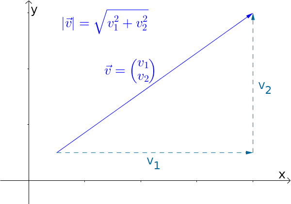
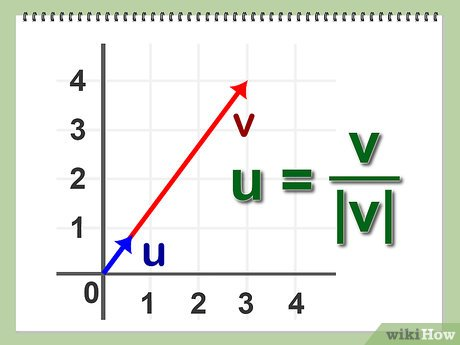
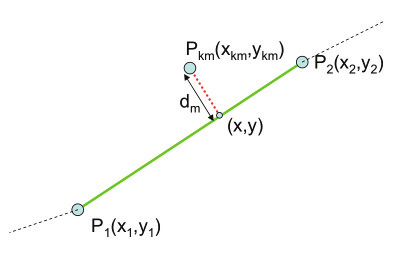
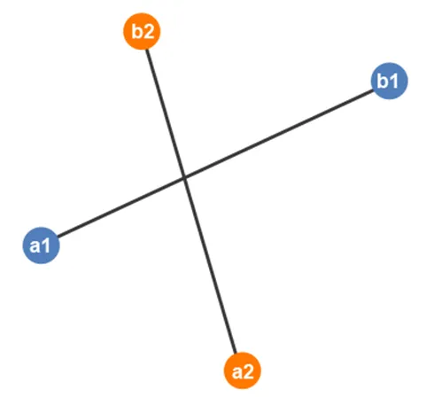

# Геометрия на плоскости

Точка и вектор хранят по два числа, но смысл у них разный: точка — это место,
вектор — сдвиг. Поэтому типы разные, и функции принимают именно то, что им нужно.

Типы лежат в `geometry.h`:

```c
struct point {
    double x;
    double y;
};

struct vector {
    double x;
    double y;
};

struct segment {
    struct point a;
    struct point b;
};

struct intersection {
    bool exists;
    struct point p;
};
```

Реализовать в `geometry.c`:

```c
struct vector vector_between(struct point a, struct point b);
double vector_dot(struct vector u, struct vector v);
double vector_length(struct vector v);
struct vector vector_normalize(struct vector v);

double point_segment_distance(struct point p, struct segment s);
struct intersection segments_intersect(struct segment s1, struct segment s2);
```

`segments_intersect` — пример функции, которой нужно вернуть два разных ответа
сразу: есть ли пересечение и где оно. Через `return` уходит структура, так что
выходные параметры не нужны.

## Математика

### Вектор по двум точкам(vector_between)


Вектор из `A` в `B` — это разность координат:

```
AB = B - A = (b.x - a.x, b.y - a.y)
```

### Скалярное произведение(vector_dot)


```
u · v = u.x * v.x + u.y * v.y
```

Геометрический смысл: `u · v = |u| * |v| * cos(a)`, где `a` — угол между
векторами. Отсюда читается взаимное расположение:

- `u · v > 0` — угол острый, векторы смотрят примерно в одну сторону;
- `u · v = 0` — векторы перпендикулярны;
- `u · v < 0` — угол тупой.

Частный случай, который дальше нужен постоянно: `v · v = |v|^2`, потому что
`cos(0) = 1`.

### Длина вектора(vector_length)

Теорема Пифагора для катетов `x` и `y`:


```
|v| = sqrt(v · v) = sqrt(x^2 + y^2)
```

### Нормализация(vector_normalize)


Поделив вектор на его длину, получаем вектор той же направленности, но длины 1:

```
unit = v / |v| = (x / |v|, y / |v|)
```

Такой вектор задаёт чистое направление. У нулевого вектора направления нет,
и делить на ноль нельзя, поэтому по условию задачи возвращаем `(0, 0)`.

### Расстояние от точки до отрезка(point_segment_distance)



Отрезок задан концами `A` и `B`, дана точка `P`. Любая точка отрезка
записывается через параметр `t`:

```
C(t) = A + t * AB,   t от 0 до 1
```

При `t = 0` это `A`, при `t = 1` это `B`.

Ближайшая точка прямой — основание перпендикуляра из `P`. Значит вектор
`C(t) - P` перпендикулярен `AB`, а скалярное произведение перпендикулярных
векторов равно нулю:

```
(A + t * AB - P) · AB = 0
(t * AB - AP) · AB = 0
t * (AB · AB) = AP · AB
t = (AP · AB) / (AB · AB)
```

Знаменатель `AB · AB` — это `|AB|^2`, поэтому `t` — доля длины отрезка.

Найденное `t` может выйти за отрезок, и тогда его надо обрезать:

- `t < 0` — перпендикуляр падает за точкой `A`, ближайшая точка сама `A`;
- `t > 1` — перпендикуляр падает за `B`, ближайшая точка сама `B`;
- иначе ближайшая точка `C = A + t * AB`.

Обрезать по краям можно потому, что квадрат расстояния — парабола по `t`:
вне отрезка она только растёт, если удаляться от найденного минимума.

Ответ — длина вектора от `C` до `P`.

Вырожденный случай: если `A` и `B` совпали, то `AB · AB = 0` и делить нельзя.
Тогда отрезок — это точка, берём `t = 0` и возвращаем `|AP|`.

### Пересечение двух отрезков(segments_intersect)



Понадобится косое (псевдоскалярное) произведение:

```
cross(u, v) = u.x * v.y - u.y * v.x
```

Это площадь параллелограмма со знаком: `cross(u, v) = |u| * |v| * sin(a)`.
Ноль означает `sin(a) = 0`, то есть векторы параллельны.

Запишем оба отрезка через параметры:

```
s1: P + t * r,   P = s1.a,   r = s1.b - s1.a,   t от 0 до 1
s2: Q + u * s,   Q = s2.a,   s = s2.b - s2.a,   u от 0 до 1
```

В точке пересечения `P + t * r = Q + u * s`. Обозначим `w = Q - P`:

```
t * r - u * s = w
```

Косо умножаем обе части на `s`. Слагаемое с `u` исчезает, потому что
`cross(s, s) = 0`:

```
t * cross(r, s) = cross(w, s)
t = cross(w, s) / cross(r, s)
```

Теперь косо умножаем на `r`. Исчезает слагаемое с `t`, а `cross(s, r)`
меняет знак на `-cross(r, s)`:

```
u * cross(r, s) = cross(w, r)
u = cross(w, r) / cross(r, s)
```

Дальше разбор случаев по `d = cross(r, s)`:

- `d = 0` — отрезки параллельны или лежат на одной прямой. У лежащих на одной
  прямой отрезков общих точек может быть бесконечно много, а вернуть надо одну,
  поэтому в этой задаче такой случай считается отсутствием пересечения:
  `exists = false`.
- `d != 0` — прямые пересекаются ровно в одной точке. Она попадает на оба
  отрезка, только если `0 <= t <= 1` и `0 <= u <= 1`. Тогда `exists = true`,
  а сама точка равна `P + t * r`.

Отрезок нулевой длины даёт `r = (0, 0)` и `d = 0`, то есть тоже попадает в
случай «пересечения нет».

### Сравнение вещественных чисел

После умножений и делений точный ноль почти не встречается (урок 003), поэтому
сравнивать `d == 0` нельзя. Сравнения идут с допуском:

```c
static const double EPS = 1e-9;

if (fabs(d) < EPS) { ... }               // считаем нулём
if (t < -EPS || t > 1.0 + EPS) { ... }   // t вне отрезка
```

Допуск по краям важен для отрезков, которые касаются концами: там `t` или `u`
получается ровно 0 или 1, но с погрешностью.

## Требования

- Все структуры маленькие, поэтому передаются и возвращаются по значению.
- Аргументы не менять, каждая функция возвращает новое значение.
- `sqrt` и `fabs` берутся из `<math.h>`, сборка с `-lm`.
- `cross` и `EPS` объявить со `static`: в интерфейсе их нет.
- Нулевой вектор нормализуется в `(0, 0)`.
- Параллельные и лежащие на одной прямой отрезки: `exists = false`.

## Сборка

```sh
gcc -Wall -Wextra -std=c17 main.c geometry.c -o app -lm
./app < basic.txt
```

## Формат ввода

```
X1 Y1 X2 Y2
X3 Y3 X4 Y4
PX PY
```

Первая строка — концы первого отрезка, вторая — концы второго, третья — точка.
Программа печатает пять строк: вектор первого отрезка с длиной, тот же вектор
после нормализации, скалярное произведение векторов двух отрезков, расстояние
от точки до первого отрезка и точку пересечения (или `none`).

## Примеры

```
0 0 4 3
0 3 4 0
0 3
```

```
v1 = (4.0000, 3.0000), |v1| = 5.0000
unit v1 = (0.8000, 0.6000), |unit| = 1.0000
dot(v1, v2) = 7.0000
distance from point to s1 = 2.4000
intersection: (2.0000, 1.5000)
```

---

```
0 0 4 0
0 2 4 2
2 2
```

```
v1 = (4.0000, 0.0000), |v1| = 4.0000
unit v1 = (1.0000, 0.0000), |unit| = 1.0000
dot(v1, v2) = 16.0000
distance from point to s1 = 2.0000
intersection: none
```
