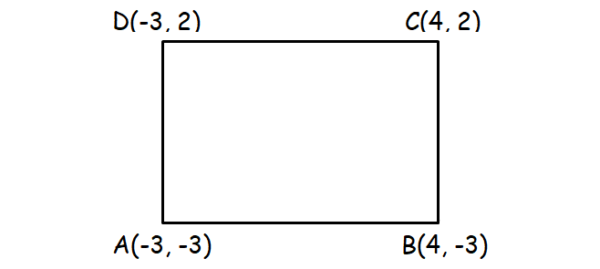

# Прямоугольники


Прямоугольник со сторонами, параллельными осям, задаётся двумя углами: левым
нижним и правым верхним. Типы лежат в `rect.h`:

```c
struct point {
    double x;
    double y;
};

struct rect {
    struct point min;
    struct point max;
};
```

Реализовать в `rect.c`:

```c
struct rect rect_make(struct point a, struct point b);
bool rect_is_empty(struct rect r);
double rect_area(struct rect r);

struct rect rect_intersect(struct rect a, struct rect b);
struct rect rect_union(struct rect a, struct rect b);
bool rect_contains(struct rect outer, struct rect inner);
```

## Математика

### Прямоугольник — это два отрезка

Прямоугольник со сторонами вдоль осей — это пара независимых отрезков на осях:

```
[min.x, max.x] по горизонтали и [min.y, max.y] по вертикали
```

Точка внутри тогда и только тогда, когда её `x` попал в первый отрезок, а `y` —
во второй. Поэтому все задачи ниже решаются по каждой оси отдельно, а потом
результаты просто складываются в одну структуру.

### Пересечение(rect_intersect)

Пересечение двух отрезков `[a1, a2]` и `[b1, b2]` на одной оси:

```
[max(a1, b1), min(a2, b2)]
```

Начало общей части — самое правое из двух начал, конец — самое левое из двух
концов. Если после этого начало оказалось не левее конца, общей части нет.

Для прямоугольников то же самое по обеим осям:

```
min = (max(a.min.x, b.min.x), max(a.min.y, b.min.y))
max = (min(a.max.x, b.max.x), min(a.max.y, b.max.y))
```

Достаточно разойтись по одной оси, чтобы пересечения не было.

### Объединение (bounding box) (rect_union)

Объединение двух прямоугольников в общем случае не прямоугольник: у двух
пересекающихся прямоугольников получается фигура ступенькой. Поэтому считают
не саму фигуру, а наименьший прямоугольник, который содержит оба:

```
min = (min(a.min.x, b.min.x), min(a.min.y, b.min.y))
max = (max(a.max.x, b.max.x), max(a.max.y, b.max.y))
```

Здесь всё наоборот по сравнению с пересечением: берём самое левое начало и
самый правый конец.

### Вложенность (rect_contains)

`inner` лежит внутри `outer`, если по каждой оси отрезок `inner` лежит внутри
отрезка `outer`:

```
outer.min.x <= inner.min.x   и   inner.max.x <= outer.max.x
outer.min.y <= inner.min.y   и   inner.max.y <= outer.max.y
```

Сравнения нестрогие, поэтому прямоугольник, прижатый к границе, тоже считается
вложенным. Прямоугольник вложен сам в себя.

### Площадь

```
area = (max.x - min.x) * (max.y - min.y)
```

У пустого прямоугольника площадь 0, и считать её по формуле нельзя: при
`min.x > max.x` и `min.y > max.y` два минуса дали бы положительное число.

## Как представить пустоту

Пересечения может не быть, а возвращать функция должна прямоугольник. Значит
нужен способ сказать «здесь ничего нет». Вариантов несколько:

1. **Отдельное поле-флаг**: `struct rect { bool empty; struct point min, max; }`.
   Честно, но флаг нужно поддерживать в каждой функции, и появляются
   противоречивые значения: флаг говорит «не пустой», а ширина нулевая.
2. **Возвращать `bool`, а прямоугольник отдавать через выходной параметр**:
   `bool rect_intersect(struct rect a, struct rect b, struct rect* out)`.
   Работает, но результат нельзя сразу передать дальше: вместо
   `rect_area(rect_intersect(a, b))` придётся заводить переменную.
3. **Считать пустоту свойством самих координат**. Прямоугольник пуст, если

   ```
   min.x >= max.x   или   min.y >= max.y
   ```

   Лишних полей нет, проверить результат может кто угодно и когда угодно.

В задании берём третий вариант. Из него следуют правила, которые надо соблюдать:

- Пустой результат функции возвращают в одном каноническом виде — `(0,0)-(0,0)`.
  Смотреть на координаты пустого прямоугольника вызывающему нельзя, у него есть
  только `rect_is_empty`.
- Если хотя бы один вход пустой, пересечение пустое.
- В объединении пустой прямоугольник пропускается: он ничего не добавляет к
  границам. Объединение двух пустых — пустой прямоугольник.
- Пустой прямоугольник ни в чём не лежит и ничего не содержит: `rect_contains`
  с пустым аргументом возвращает `false`.
- Прямоугольники, соприкасающиеся ровно по ребру, дают нулевую ширину, то есть
  пустое пересечение. Их общая часть — отрезок, а отрезок не прямоугольник.

Отдельно стоит заметить, что `rect_make` приводит любые два противоположных
угла к виду `min <= max`, и все остальные функции это свойство сохраняют:
они только выбирают уже существующие координаты, не вычисляя новых. Поэтому
здесь не нужен допуск `EPS`, как в задании про отрезки: новых погрешностей не
появляется.

## Требования

- Структуры маленькие: передаются и возвращаются по значению, аргументы не менять.
- `min` и `max` для `double` вынести во вспомогательные функции со `static`,
  как и канонический пустой прямоугольник. В интерфейсе их нет.
- `rect_area` для пустого возвращает 0.
- `<math.h>` не нужен: `fmin` и `fmax` тут лишние, хватает сравнения.

## Сборка

```sh
gcc -Wall -Wextra -std=c17 main.c rect.c -o app
./app < basic.txt
```

## Формат ввода

```
X1 Y1 X2 Y2
X3 Y3 X4 Y4
```

Первая строка — два противоположных угла первого прямоугольника, вторая — второго.
Углы можно давать в любом порядке, `rect_make` их упорядочит. Программа печатает
оба прямоугольника, их пересечение, объединение и две проверки вложенности.

## Примеры

Готовые файлы ввода лежат рядом с заданием: `./a.out < basic.txt`.

**[basic.txt](basic.txt)**

```
0 0 4 3
2 1 6 5
```

```
a = (0.00, 0.00)-(4.00, 3.00), area = 12.00
b = (2.00, 1.00)-(6.00, 5.00), area = 16.00
intersect = (2.00, 1.00)-(4.00, 3.00), area = 4.00
union = (0.00, 0.00)-(6.00, 5.00), area = 30.00
a contains b: no
b contains a: no
```

---

**[touch.txt](touch.txt)** — прямоугольники стоят вплотную, общая часть — отрезок, поэтому пересечение пустое:

```
0 0 2 2
2 0 4 2
```

```
a = (0.00, 0.00)-(2.00, 2.00), area = 4.00
b = (2.00, 0.00)-(4.00, 2.00), area = 4.00
intersect = empty, area = 0.00
union = (0.00, 0.00)-(4.00, 2.00), area = 8.00
a contains b: no
b contains a: no
```

---

**[border_touch.txt](border_touch.txt)**

```
0 0 4 4
0 0 2 2
```

```
a = (0.00, 0.00)-(4.00, 4.00), area = 16.00
b = (0.00, 0.00)-(2.00, 2.00), area = 4.00
intersect = (0.00, 0.00)-(2.00, 2.00), area = 4.00
union = (0.00, 0.00)-(4.00, 4.00), area = 16.00
a contains b: yes
b contains a: no
```

---

**[degenerate.txt](degenerate.txt)**

```
1 1 1 5
0 0 4 4
```

```
a = empty, area = 0.00
b = (0.00, 0.00)-(4.00, 4.00), area = 16.00
intersect = empty, area = 0.00
union = (0.00, 0.00)-(4.00, 4.00), area = 16.00
a contains b: no
b contains a: no
```

---

**[disjoint.txt](disjoint.txt)**

```
0 0 2 2
5 5 7 7
```

```
a = (0.00, 0.00)-(2.00, 2.00), area = 4.00
b = (5.00, 5.00)-(7.00, 7.00), area = 4.00
intersect = empty, area = 0.00
union = (0.00, 0.00)-(7.00, 7.00), area = 49.00
a contains b: no
b contains a: no
```

---

**[negatives.txt](negatives.txt)**

```
-4 -3 0 0
-2 -5 2 -1
```

```
a = (-4.00, -3.00)-(0.00, 0.00), area = 12.00
b = (-2.00, -5.00)-(2.00, -1.00), area = 16.00
intersect = (-2.00, -3.00)-(0.00, -1.00), area = 4.00
union = (-4.00, -5.00)-(2.00, 0.00), area = 30.00
a contains b: no
b contains a: no
```

---

**[nested.txt](nested.txt)**

```
0 0 10 10
2 2 5 5
```

```
a = (0.00, 0.00)-(10.00, 10.00), area = 100.00
b = (2.00, 2.00)-(5.00, 5.00), area = 9.00
intersect = (2.00, 2.00)-(5.00, 5.00), area = 9.00
union = (0.00, 0.00)-(10.00, 10.00), area = 100.00
a contains b: yes
b contains a: no
```

---

**[same.txt](same.txt)**

```
1 1 5 4
1 1 5 4
```

```
a = (1.00, 1.00)-(5.00, 4.00), area = 12.00
b = (1.00, 1.00)-(5.00, 4.00), area = 12.00
intersect = (1.00, 1.00)-(5.00, 4.00), area = 12.00
union = (1.00, 1.00)-(5.00, 4.00), area = 12.00
a contains b: yes
b contains a: yes
```

---

**[unordered.txt](unordered.txt)**

```
4 3 0 0
6 5 2 1
```

```
a = (0.00, 0.00)-(4.00, 3.00), area = 12.00
b = (2.00, 1.00)-(6.00, 5.00), area = 16.00
intersect = (2.00, 1.00)-(4.00, 3.00), area = 4.00
union = (0.00, 0.00)-(6.00, 5.00), area = 30.00
a contains b: no
b contains a: no
```
