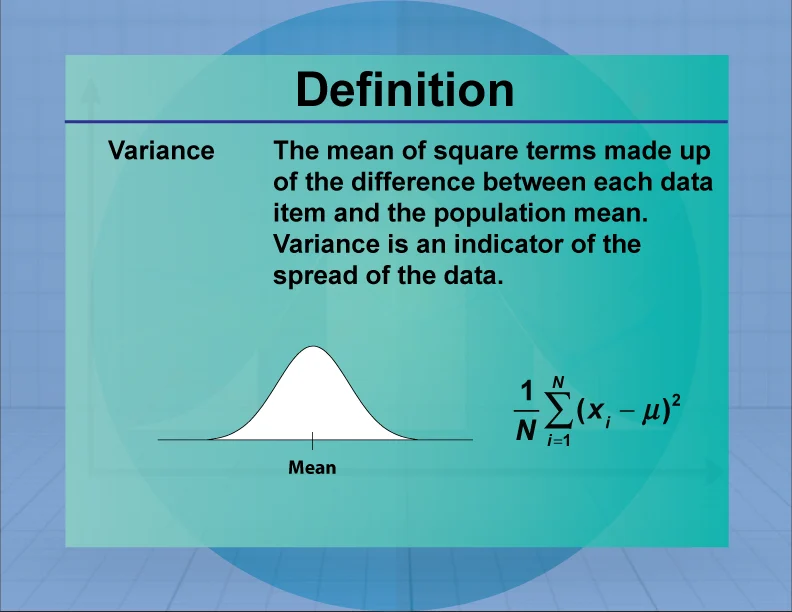

# Накопитель статистики

Структура здесь — объект состояния. Её один раз инициализируют, потом
скармливают ей числа по одному, а итог можно спросить в любой момент. Сами
числа нигде не хранятся: сколько бы их ни пришло, вся память — одна структура
в 40 байт.

Типы и функции лежат в `stats.h`:

```c
struct stats {
    size_t n;
    double sum;
    double min;
    double max;
    double m2;
};

void stats_init(struct stats* s);
void stats_add(struct stats* s, double x);
double stats_mean(const struct stats* s);

double stats_variance(const struct stats* s);
double stats_stddev(const struct stats* s);
```

`stats_init` уже написана. Реализовать остальные функции в `stats.c`.

## Основная часть

- `stats_add` обновляет `n`, `sum`, `min` и `max`. Первому числу сравнивать
  не с чем, поэтому оно сразу становится и минимумом, и максимумом: это случай
  `n == 0`.
- `stats_mean` возвращает `sum / n`. У пустого накопителя среднего нет, по
  условию возвращаем 0; `main` для пустого его и не спрашивает.

`stats_add` меняет состояние, поэтому получает обычный указатель. Остальные
функции только читают: `const struct stats*` не копирует структуру и не даёт
её изменить (урок `02_params`).

## Расширение: дисперсия по алгоритму Уэлфорда

### Что считаем


Среднее и отклонение числа от него:

```
mean = (x1 + x2 + ... + xn) / n
отклонение i-го числа = xi - mean
```

Дисперсия — среднее квадратов отклонений, стандартное отклонение — корень из
неё. Стандартное отклонение измеряется в тех же единицах, что и сами данные:

```
variance = ((x1 - mean)^2 + ... + (xn - mean)^2) / n
stddev = sqrt(variance)
```

Числитель дисперсии, сумму квадратов отклонений, обозначим `M2`. Именно его
хранит поле `m2`, а дисперсия потом равна `M2 / n`.

Пример: для `2 4 4 4 5 5 7 9` среднее 5, отклонения `-3 -1 -1 -1 0 0 2 4`,
их квадраты в сумме дают `M2 = 32`, дисперсия `32 / 8 = 4`, отклонение `2`.

В статистике для выборки часто делят на `n - 1`, а не на `n`. Здесь делим на
`n`: считаем дисперсию самого набора чисел.

### Почему не хватает суммы квадратов

Если раскрыть скобки, получится формула, которую тоже можно копить на лету:

```
variance = (x1^2 + ... + xn^2) / n - mean^2
```

Но в ней вычитаются два огромных почти равных числа. Для
`1000000004 1000000007 1000000013 1000000016` сумма квадратов около `4 * 10^18`,
а у `double` всего около 16 значащих цифр. Формула даёт дисперсию **-128**,
хотя отрицательной она не бывает, а правильный ответ 22.5. При сдвиге на `10^8`
вместо `10^9` получается 22 — тоже неверно. Это та же беда, что в уроке
`003_floating_point/04_associativity`: от разности больших чисел остаются
одни ошибки округления.

Можно пройти данные дважды: сначала найти среднее, потом сложить квадраты
отклонений. Это точно, но числа придётся где-то хранить, а у нас поток.

### Алгоритм Уэлфорда

Хранить количество, среднее и `M2`. На каждое новое число `x`:

```
mean_new = mean_old + (x - mean_old) / n
M2_new   = M2_old + (x - mean_old) * (x - mean_new)
```

Здесь `n` уже с учётом нового числа.

**Откуда формула для среднего.** Сумма первых `n` чисел равна
`n * mean_new = (n - 1) * mean_old + x`. Выразив `mean_new`, получаем первую
строку.

**Откуда шаг для `M2`.** Обозначим `a = mean_old`, `b = mean_new`. Раскрыв
скобки в определении, `M2 = (x1^2 + ... + xn^2) - n * mean^2`. Тогда

```
M2_new - M2_old = x^2 - n*b^2 + (n - 1)*a^2
```

Из формулы среднего `(n - 1)*a = n*b - x`, поэтому
`(n - 1)*a^2 = a*(n*b - x) = n*a*b - a*x`:

```
M2_new - M2_old = x^2 - a*x - n*b*(b - a)
```

Из той же формулы `n*(b - a) = x - a`:

```
M2_new - M2_old = x^2 - a*x - b*(x - a) = (x - a)*(x - b)
```

Шаг равен произведению отклонений нового числа от старого и от нового среднего.

**Почему это устойчиво.** Оба множителя — небольшие отклонения. Огромных
квадратов, которые потом вычитаются друг из друга, нигде нет.

**Почему дисперсия не уйдёт в минус.** Новое среднее `b` лежит между старым
средним `a` и числом `x`. Значит `x - a` и `x - b` одного знака, и шаг никогда
не отрицательный: `M2` только растёт.

### Как это ложится на нашу структуру

В структуре уже есть `sum`, поэтому отдельное поле для среднего не нужно:
старое среднее — `sum / n` до добавления числа, новое — после. Добавляется
только поле `m2`.

Первое число тоже не требует особого случая. Старое среднее у пустого по
условию 0, новое равно самому `x`, второй множитель `x - b` равен нулю, и
шаг получается 0.

## Требования

- Числа не сохранять: память не должна зависеть от их количества.
- Дисперсию считать только шагом Уэлфорда, без суммы квадратов.
- У пустого накопителя среднее и дисперсия равны 0.
- `sqrt` взять из `<math.h>`, сборка с `-lm`.

## Сборка

```sh
gcc -Wall -Wextra -std=c17 main.c stats.c -o app -lm
./app < basic.txt
```

## Формат ввода

Числа через пробелы или переводы строк, сколько угодно, до конца ввода
(с клавиатуры — Ctrl+D). Программа печатает количество, сумму, минимум и
максимум, среднее, дисперсию и стандартное отклонение, или `no data`, если чисел
не было.

## Примеры

Готовые файлы ввода лежат рядом с заданием: `./a.out < basic.txt`.

**[basic.txt](basic.txt)**

```
2 4 4 4 5 5 7 9
```

```
n = 8
sum = 40.0000
min = 2.0000, max = 9.0000
mean = 5.0000
variance = 4.0000
stddev = 2.0000
```

---

**[shifted.txt](shifted.txt)** — числа со сдвигом на миллиард. Формула через сумму квадратов дала бы здесь -128:

```
1000000004 1000000007 1000000013 1000000016
```

```
n = 4
sum = 4000000040.0000
min = 1000000004.0000, max = 1000000016.0000
mean = 1000000010.0000
variance = 22.5000
stddev = 4.7434
```

---

**[empty.txt](empty.txt)**

Ввод пустой.

```
n = 0
no data
```

---

**[fractions.txt](fractions.txt)**

```
0.1 0.2 0.3 0.4
```

```
n = 4
sum = 1.0000
min = 0.1000, max = 0.4000
mean = 0.2500
variance = 0.0125
stddev = 0.1118
```

---

**[negatives.txt](negatives.txt)**

```
-5 -1 -3 -7
```

```
n = 4
sum = -16.0000
min = -7.0000, max = -1.0000
mean = -4.0000
variance = 5.0000
stddev = 2.2361
```

---

**[one_to_hundred.txt](one_to_hundred.txt)** — ввод большой (292 символа), смотри в файле.

```
n = 100
sum = 5050.0000
min = 1.0000, max = 100.0000
mean = 50.5000
variance = 833.2500
stddev = 28.8661
```

---

**[same.txt](same.txt)**

```
3 3 3 3 3
```

```
n = 5
sum = 15.0000
min = 3.0000, max = 3.0000
mean = 3.0000
variance = 0.0000
stddev = 0.0000
```

---

**[single.txt](single.txt)**

```
42
```

```
n = 1
sum = 42.0000
min = 42.0000, max = 42.0000
mean = 42.0000
variance = 0.0000
stddev = 0.0000
```
