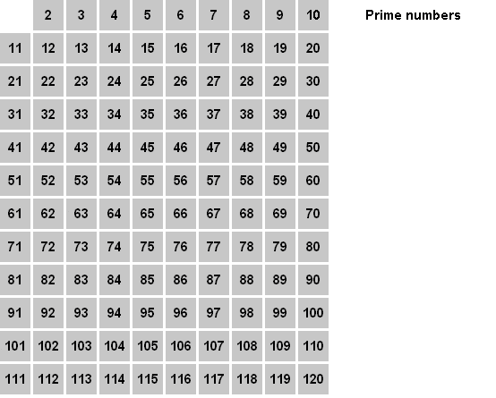

# Решето Эратосфена



[википедия](https://ru.wikipedia.org/wiki/%D0%A0%D0%B5%D1%88%D0%B5%D1%82%D0%BE_%D0%AD%D1%80%D0%B0%D1%82%D0%BE%D1%81%D1%84%D0%B5%D0%BD%D0%B0)

Задание свободное: готового интерфейса нет. Структуру, набор функций и
разбиение по файлам придумываете сами, в папке лежит только пустой `main.c`.

## Алгоритм

Ищем все простые числа, не превышающие `N`. Заводим отметку для каждого числа
от 0 до `N` и сначала считаем все числа простыми. Дальше идём по порядку: если
число `p` ещё не вычеркнуто, значит оно простое, и все его кратные составные —
вычёркиваем их.

Для `N = 30`:

```
p = 2   вычеркнуть 4, 6, 8, 10, 12, ... , 30
p = 3   вычеркнуть 9, 15, 21, 27          (6, 12, 18, 24, 30 уже вычеркнуты)
p = 5   вычеркнуть 25                     (10, 15, 20, 30 уже вычеркнуты)
дальше  p * p > 30, вычёркивать нечего

осталось: 2 3 5 7 11 13 17 19 23 29
```

Два наблюдения, которые делают решето быстрым:

1. **Вычёркивать можно начиная с `p * p`.** Меньшие кратные `2p, 3p, ...,
   (p-1)p` уже вычеркнуты, когда обрабатывались меньшие простые множители.
2. **Внешний цикл нужен только до `sqrt(N)`.** У составного числа `x` всегда
   есть делитель не больше `sqrt(x)`: будь оба делителя больше корня, их
   произведение было бы больше `x`. Значит любое составное вычеркнет какое-то
   простое не больше `sqrt(N)`.

Сколько это стоит: для каждого простого `p` вычёркивается около `N / p` чисел,
а сумма `N/2 + N/3 + N/5 + ...` по всем простым до `N` — это примерно
`N * ln(ln(N))`. Для сравнения, проверка каждого числа делением обошлась бы
примерно в `N * sqrt(N)` операций.

## Что нужно сделать

1. Придумать структуру для решета и функции вокруг неё. Решайте сами, что она
   хранит и какие операции нужны: построить, освободить, спросить «простое ли
   `x`», посчитать количество, найти наибольшее.
2. Написать `main`, который строит решето ровно на запрошенный диапазон и
   печатает наибольшее простое число среди его ячеек.
3. **Найти наибольшее простое число, не превышающее `INT_MAX`.** Это
   `2147483647`, константа из `<limits.h>`.
4. **Оценить память.** Сначала на бумаге: сколько байт нужно решету на такой
   диапазон. Напечатайте эту оценку в программе, а потом сравните с тем,
   сколько процесс занял на самом деле.

## Вопросы, на которые стоит ответить

- Сколько нужно памяти, если на число отводить один байт? А если хранить
  только нечётные числа? А если один бит на число (битовые операции будут на
  следующем уроке, но оценить можно уже сейчас)?
- Влезет ли такое решето в память вашей машины? Сколько её есть, покажет
  `free -h`. Вспомните `011_malloc/02_malloc/2_allocation.c`: выделить память
  и занять её — разные вещи, страницы приходят по мере обращения.
- Сколько времени занимает полный проход? Замерьте: `time ./app`.

## Ловушки

- **Типы.** Цикл `for (int i = 2; i <= INT_MAX; i++)` не закончится никогда:
  после `INT_MAX` счётчик переполнится, а переполнение знакового числа — это
  неопределённое поведение. Считайте в `size_t`.
- `p * p` тоже должно считаться в достаточно широком типе.
- `calloc` на пару гигабайт вполне может вернуть `NULL`. Проверяйте результат,
  как договаривались в уроке 011.
- Собирайте с `-O2`: без оптимизации решето работает в разы дольше.

## Ориентиры для самопроверки

| N | простых чисел | наибольшее простое |
|---|---|---|
| 10 | 4 | 7 |
| 100 | 25 | 97 |
| 1 000 | 168 | 997 |
| 1 000 000 | 78 498 | 999 983 |
| 1 000 000 000 | 50 847 534 | 999 999 937 |

Ответа для `INT_MAX` в таблице нет: это и есть задание. Он вас удивит.

## Требования

- Решето строится ровно на запрошенный диапазон, никаких обходных путей:
  наибольшее простое ищется среди его ячеек.
- Отметки хранить не голыми нулём и единицей, а именованными константами:

  ```c
  #define IS_PRIME 0
  #define IS_COMPOSITE 1
  ```

- Память проверять после `malloc`/`calloc` и освобождать; на небольшом `N`
  прогнать под `valgrind`.
- Без битовых операций: они на следующем уроке. Байт на число — нормально.
- Если на вашей машине `calloc` для `INT_MAX` не проходит, это тоже результат:
  запишите его и посчитайте, начиная с какого `N` память заканчивается.

## Сборка

```sh
gcc -O2 -Wall -Wextra -std=c17 main.c sieve.c -o app
./app
```

Имена файлов ваши, `sieve.c` здесь просто для примера.
